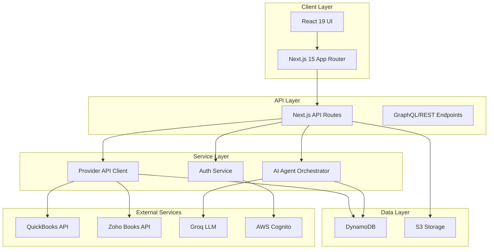
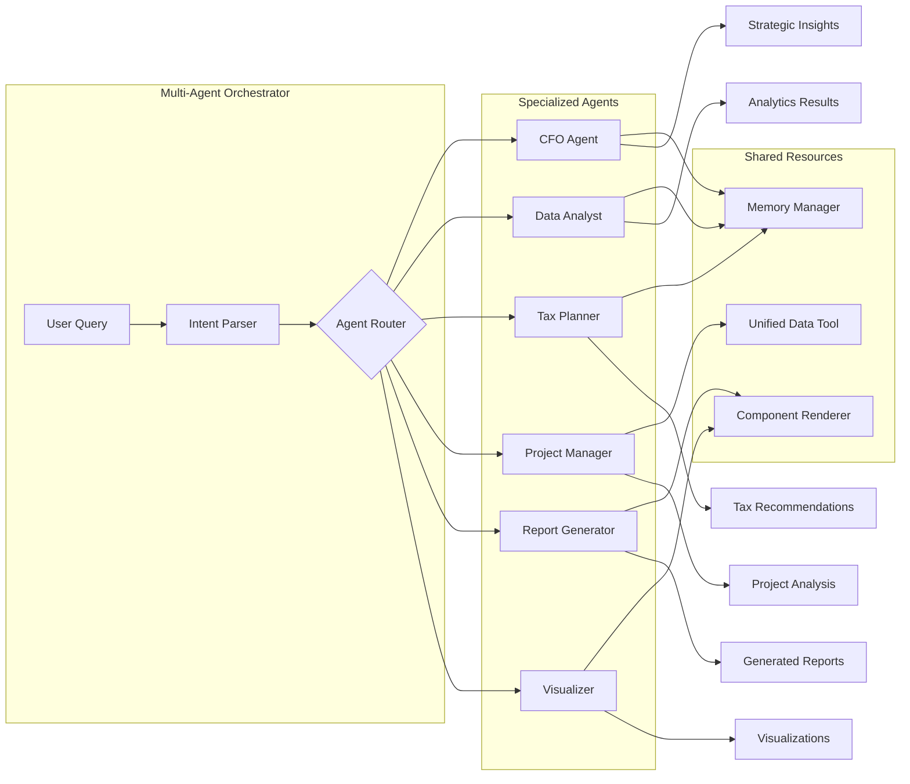
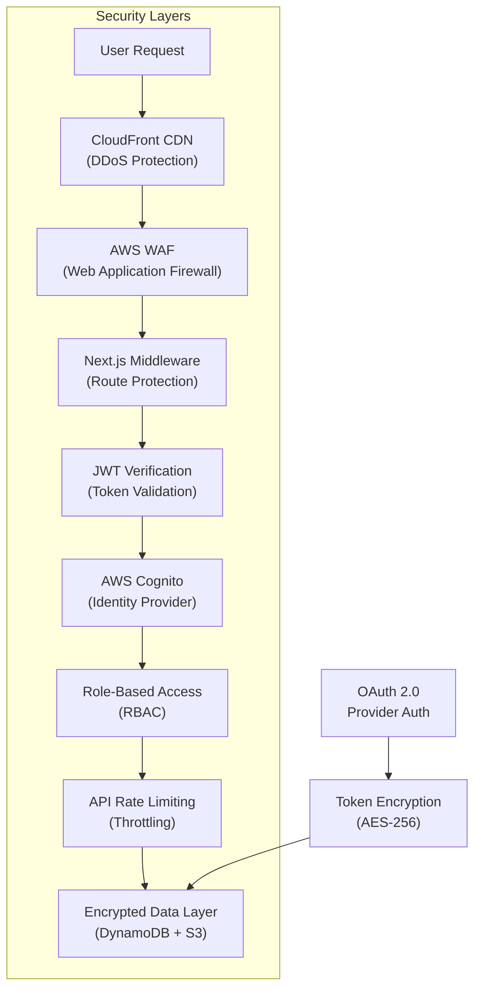
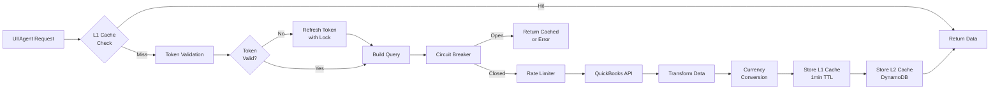
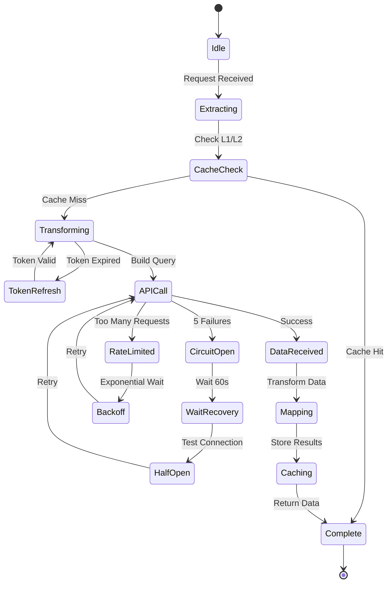
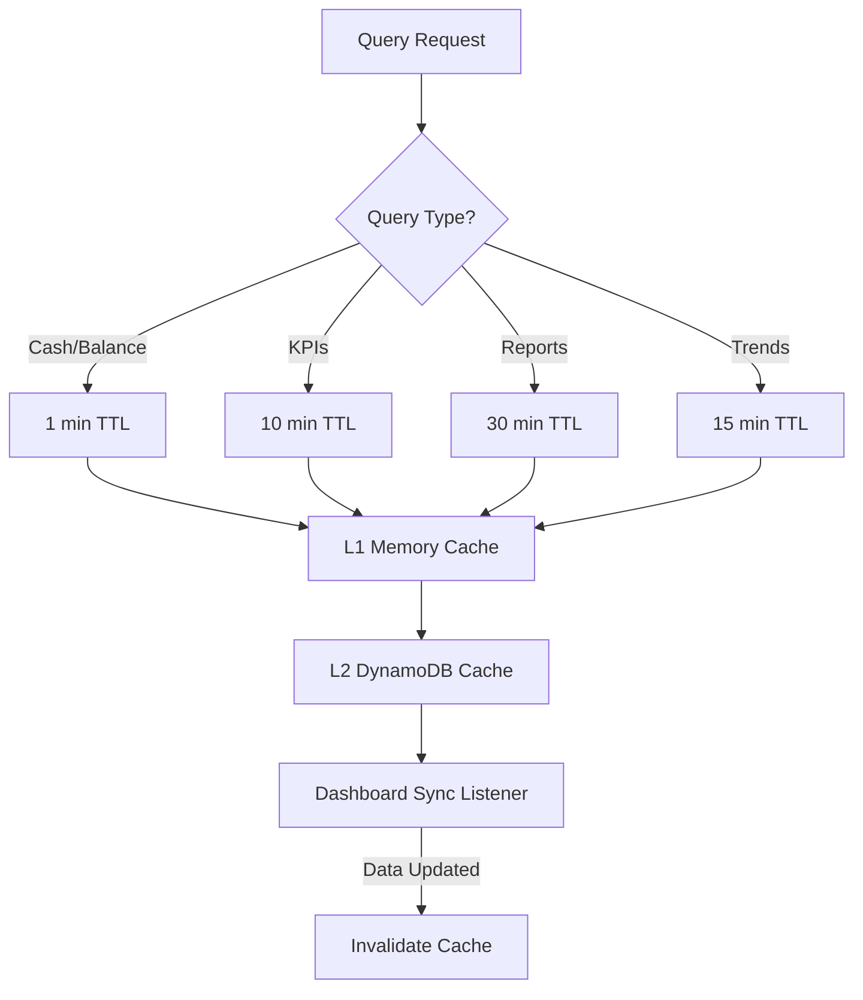

# Zenith OS - Technical Meeting Overview

## 1. Tech Overview

### Core Architecture

**Zenith OS** is a modern, AI-powered financial management platform built on a robust microservices-oriented architecture using Next.js 15 and React 19.

#### Technology Stack

- **Frontend Framework**: Next.js 15.3.2 with React 19, utilizing the new App Router for optimal performance
- **Language**: TypeScript 5+ for type-safe development across the entire codebase
- **Styling**: Tailwind CSS 4.1.7 with custom component library and container queries for responsive design
- **State Management**: SWR 2.3.6 for data fetching with intelligent caching, React Context API for global state
- **Deployment**: AWS infrastructure with Amplify for CI/CD and hosting

#### Key Integrations

- **Financial Providers**: Multi-provider architecture supporting QuickBooks, Zoho Books, and extensible for Xero/Stripe
- **Real-time Data**: WebSocket connections for live financial updates and notifications
- **Charting Libraries**: Chart.js 4.4.9 and Recharts 2.15.3 for interactive financial visualizations
- **PDF Generation**: React-PDF for automated report exports with custom formatting

#### Infrastructure Components

- **Database**: AWS DynamoDB for scalable NoSQL storage with optimized partition keys
- **Storage**: AWS S3 for document management and report archiving
- **Authentication**: AWS Cognito with JWT verification and multi-factor authentication support
- **Caching**: Upstash Redis for session management and API response caching

## 2. AI Architecture Overview

### Multi-Agent System

Our sophisticated AI architecture employs specialized agents working in concert to provide comprehensive financial intelligence.

#### Core AI Components

- **LLM Provider**: Groq's Llama 3.3 70B model via LangChain integration, configured for 24K token responses
- **Agent Orchestrator**: Coordinates between specialized agents using a message-passing architecture
- **Memory System**: DynamoDB-backed contextual memory with relevance scoring and TTL management

#### Specialized Agents

1. **CFO Agent**: Strategic financial advisory, trend analysis, and performance insights
2. **Data Analyst Agent**: Deep-dive analytics, pattern recognition, and anomaly detection
3. **Tax Planning Agent**: Tax optimization strategies and compliance recommendations
4. **Project Manager Agent**: QuickBooks project profitability analysis and resource allocation
5. **Report Generator Agent**: Automated financial report creation with dynamic layouts
6. **Visualizer Agent**: Intelligent chart selection and data visualization generation

#### AI Capabilities

- **Natural Language Processing**: Conversational interface for complex financial queries
- **Predictive Analytics**: Forecasting tools with trend analysis and scenario modeling
- **Component Rendering**: Dynamic UI generation based on data patterns and user intent
- **Memory Enhancement**: Learning from past interactions for personalized insights
- **Rate Limiting**: Intelligent request management to ensure consistent performance

### Visualization Engine

- **Dynamic Chart Selection**: AI automatically selects optimal chart types based on data characteristics
- **Flexible Rendering**: Support for 15+ chart types with real-time data updates
- **Export Capabilities**: HTML-to-Canvas conversion for report generation
- **Interactive Dashboards**: Drill-down capabilities with contextual tooltips

## 3. Security and Data Privacy

### Authentication & Authorization

- **AWS Cognito Integration**: Enterprise-grade identity management with MFA support
- **JWT Token Verification**: Dual-token system (access + ID tokens) with secure cookie storage
- **Session Management**: 1-hour token expiry with automatic refresh mechanism
- **Middleware Protection**: Route-level security enforcement with granular access control

### Data Protection Measures

- **Encryption at Rest**: All DynamoDB tables encrypted using AWS KMS
- **Encryption in Transit**: TLS 1.3 for all API communications
- **OAuth 2.0 Security**: CSRF protection with state validation and nonce verification
- **Token Storage**: Secure HTTP-only cookies with SameSite protection

### Provider Security

- **Credential Isolation**: Provider tokens stored separately with organization-level encryption
- **Circuit Breaker Pattern**: Automatic failover for provider API failures
- **Rate Limiting**: Per-provider throttling to prevent API abuse
- **Audit Logging**: Comprehensive OAuth event monitoring and security alerts

### Compliance Features

- **Data Residency**: Regional data storage with configurable AWS regions
- **Access Control**: Role-based permissions with organization hierarchy
- **Data Retention**: Configurable TTL with automatic data purging
- **Privacy Controls**: User-level data deletion and export capabilities

## 4. Data ETL Pipeline with QuickBooks

### Data Extraction Architecture

Our ETL pipeline implements a sophisticated multi-layered approach to efficiently extract and process financial data from QuickBooks Online.

#### Extraction Layer

- **SQL-like Query Interface**: QuickBooks API queries using optimized field selection to minimize payload size
- **Batch Processing**: Default batch size of 50 records with configurable pagination for large datasets
- **Selective Field Extraction**: Only requested fields are retrieved (e.g., Id, DocNumber, TxnDate, Balance)
- **API-level Filtering**: WHERE clauses pushed to QuickBooks API to reduce data transfer

#### Data Transformation

- **Real-time Mapping**: Custom mappers convert QuickBooks entities to standardized internal format
- **Currency Normalization**: Multi-currency transactions automatically converted to organization's base currency
- **Status Harmonization**: Complex QuickBooks statuses mapped to simplified internal statuses
- **Hierarchical Processing**: Nested data structures (line items, tax details) flattened for analysis

#### Intelligent Caching System

- **Multi-tier Cache Strategy**:
  - **L1 Cache**: In-memory request cache with 1-minute TTL for identical queries
  - **L2 Cache**: DynamoDB persistent cache for reports (5-30 minute TTL based on data type)
  - **Dashboard Sync**: Automatic cache invalidation when dashboard data updates
- **TTL Optimization by Query Type**:
  - Cash/Balance queries: 1-minute cache (real-time critical)
  - KPIs and metrics: 10-minute cache (moderate freshness)
  - Historical reports: 30-minute cache (stable data)
  - Trend analysis: 15-minute cache (balanced approach)

#### Performance Optimization

- **Circuit Breaker Pattern**: Prevents cascading failures during QuickBooks API outages
  - Opens after 5 consecutive failures
  - 1-minute recovery timeout before retry
  - Requires 3 successful calls to fully close
- **Rate Limiting**: Intelligent throttling to respect QuickBooks API limits
  - Per-organization rate tracking
  - Exponential backoff for retries
  - Queue-based request management
- **Token Management**: Distributed locking for OAuth token refresh
  - 30-second wait for concurrent refresh operations
  - 60-second timeout for individual refreshes
  - Automatic token renewal 2 minutes before expiry

#### Data Pipeline Flow

1. **Request Initiation**: API call from UI component or AI agent
2. **Cache Check**: L1 memory cache consulted for recent identical queries
3. **Token Validation**: OAuth tokens verified and refreshed if needed (with distributed lock)
4. **Query Construction**: Optimized SQL-like query built with API-level filters
5. **API Execution**: Request sent through circuit breaker and rate limiter
6. **Data Transformation**: Response mapped to internal format with currency conversion
7. **Cache Storage**: Results stored in both L1 and L2 caches with appropriate TTL
8. **Response Delivery**: Transformed data returned to requesting component

#### Sync Operations

- **Incremental Sync**: Uses LastUpdatedTime for delta updates
- **Full Sync**: Complete data refresh triggered manually or on schedule
- **Webhook Integration**: Real-time updates for critical entities (invoices, payments)
- **Conflict Resolution**: Last-write-wins with audit trail for concurrent updates

#### Data Volume Handling

- **Pagination Strategy**: Automatic pagination for large result sets
- **Streaming Processing**: Large reports processed in chunks to prevent memory overflow
- **Parallel Fetching**: Multiple entities fetched concurrently with connection pooling
- **Compression**: Response data compressed for storage in DynamoDB

### Caching Strategy Visualization

## 5. Frequently Asked Questions

### Q: How does the AI ensure accuracy in financial analysis?

**A:** Our multi-agent system cross-validates insights through specialized agents. The Data Analyst Agent performs deep statistical analysis while the CFO Agent provides strategic validation. All recommendations are based on real-time data from connected accounting systems, ensuring accuracy through source verification.

### Q: What happens if a financial provider's API goes down?

**A:** We implement a circuit breaker pattern with automatic failover. Cached data remains available for viewing, users receive immediate notifications about sync status, and the system automatically retries with exponential backoff. Critical financial data is preserved in our DynamoDB cache for business continuity.

### Q: How quickly can the system generate comprehensive reports?

**A:** Report generation typically takes 3-5 seconds for standard reports. Our Report Generator Agent pre-processes data in parallel, uses cached calculations for KPIs, and streams results progressively. Complex multi-period analyses may take up to 10 seconds.

### Q: Can the AI learn from our specific business patterns?

**A:** Yes, our Memory Manager stores interaction history and business-specific insights. The system learns terminology, preferences, and patterns unique to your organization while maintaining strict data isolation between different organizations.

### Q: How secure is our financial data?

**A:** We employ bank-level security with AWS Cognito authentication, AES-256 encryption for all stored data, OAuth 2.0 with PKCE for provider connections, and regular security audits. No financial credentials are stored directly - only encrypted OAuth tokens.

### Q: What's the maximum data volume the system can handle?

**A:** Our architecture scales horizontally with DynamoDB supporting millions of transactions, real-time processing of up to 10,000 transactions per second, and automatic partitioning for large datasets. The system has been tested with 5+ years of historical financial data.

### Q: How does the AI decide which visualizations to create?

**A:** The Visualizer Agent analyzes data characteristics including temporal patterns, categorical distributions, and correlation matrices. It then selects from 15+ chart types based on data volume, user query intent, and best practices for financial visualization.

### Q: Can we customize the AI's analysis parameters?

**A:** Yes, through our flexible configuration system. You can adjust risk tolerance levels, forecasting horizons, KPI thresholds, and report formats. The AI adapts its analysis based on your industry and business model.

### Q: What providers can we integrate with?

**A:** Currently supporting QuickBooks Online and Zoho Books with full bi-directional sync. Xero integration is in our architecture (provider interface ready). The system is designed for easy provider addition through our standardized interface pattern.

### Q: How does the system handle multi-currency transactions?

**A:** We have a dedicated Currency Context that manages exchange rates, performs automatic conversion for consolidated reporting, maintains historical rates for accurate period comparisons, and supports 150+ global currencies through our provider APIs.

---

_This document represents the current production state of Zenith OS as of January 2025. All features described are fully implemented and operational in the codebase._
