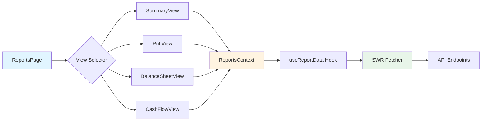
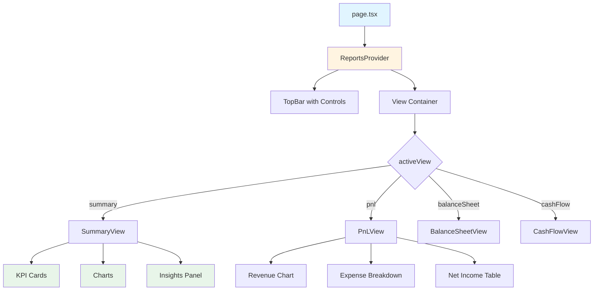
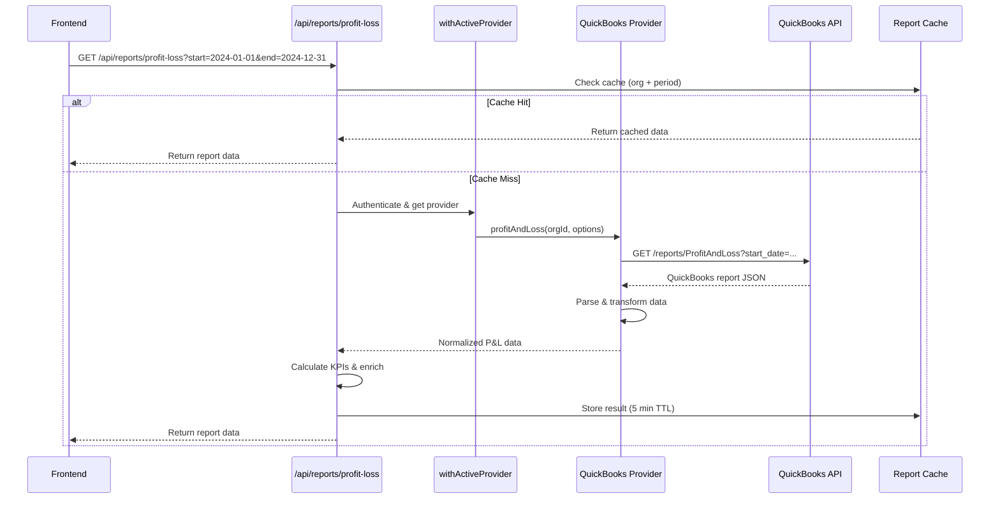
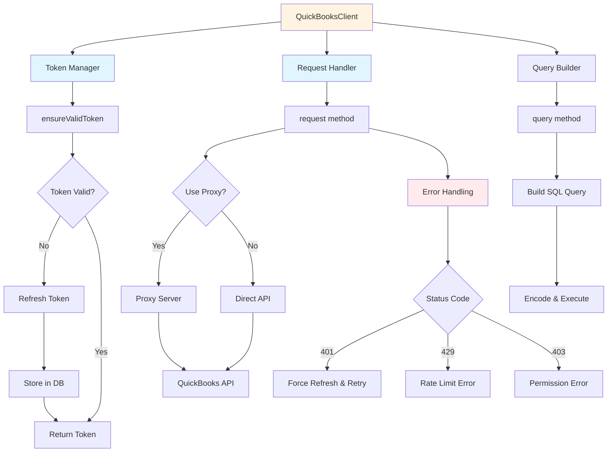
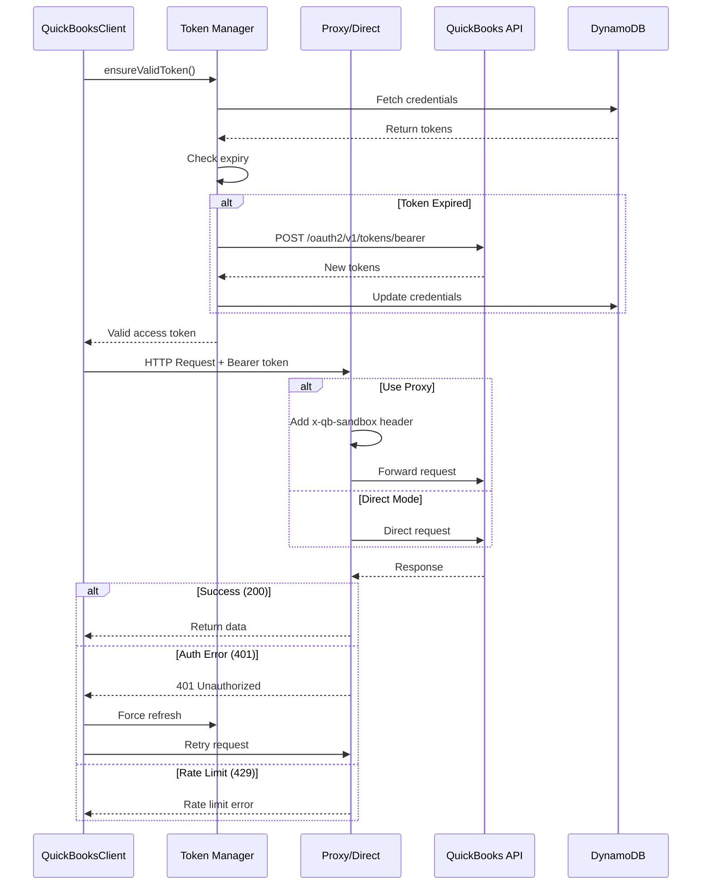
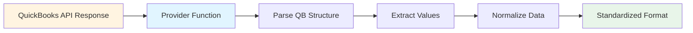
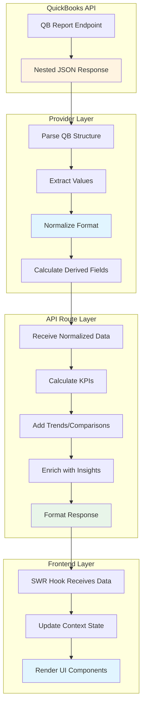
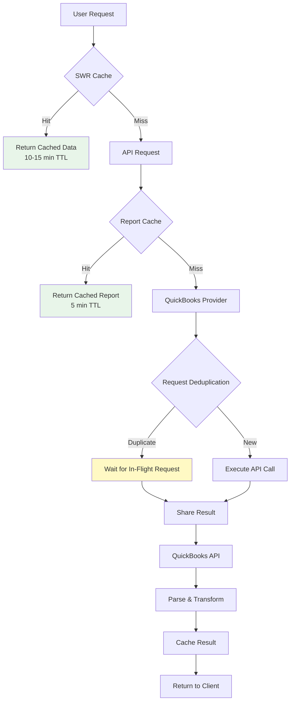
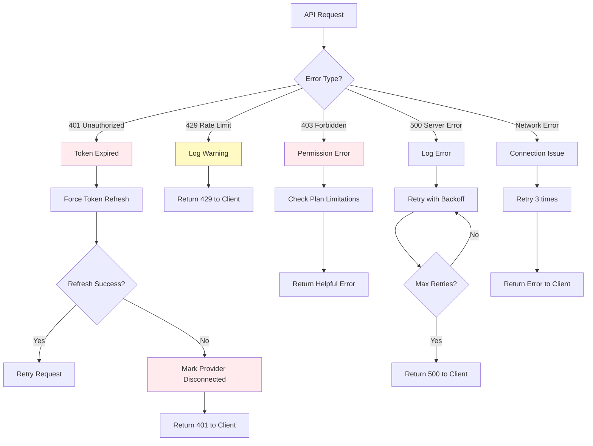

# Reports Infrastructure & QuickBooks Integration

> Comprehensive technical documentation for the Zenith OS reporting system and QuickBooks data integration layer.

**Last Updated:** 2025-10-03
**Author:** Development Team
**Purpose:** Knowledge transfer for developers working on the reporting infrastructure

---

## Table of Contents

1. [High-Level Architecture](#high-level-architecture)
2. [Frontend Layer](#frontend-layer)
3. [API Layer](#api-layer)
4. [QuickBooks Integration Layer](#quickbooks-integration-layer)
5. [Data Transformation Pipeline](#data-transformation-pipeline)
6. [Caching & Performance Strategy](#caching--performance-strategy)
7. [Error Handling & Resilience](#error-handling--resilience)
8. [Key Learnings & Edge Cases](#key-learnings--edge-cases)

---

## High-Level Architecture

The reporting infrastructure follows a **layered architecture** pattern with clear separation of concerns:

```mermaid
graph TB
    subgraph "Frontend Layer"
        A[Report Views] --> B[ReportsContext]
        A --> C[Custom Hooks]
        C --> D[SWR Cache]
    end

    subgraph "API Layer"
        E[/api/reports/profit-loss]
        F[/api/reports/balance-sheet]
        G[/api/reports/cash-flow]
    end

    subgraph "Provider Layer"
        H[withActiveProvider]
        I[QuickBooks Provider]
        J[Report Functions]
    end

    subgraph "QuickBooks Integration"
        K[QuickBooksClient]
        L[Token Manager]
        M[API Proxy]
        N[QuickBooks API]
    end

    subgraph "Caching Layers"
        O[SWR Client Cache<br/>10-15 min TTL]
        P[Report Cache<br/>5 min TTL]
        Q[Request Deduplication]
    end

    D --> E
    D --> F
    D --> G

    E --> H
    F --> H
    G --> H

    H --> I
    I --> J
    J --> K

    K --> L
    L --> M
    M --> N

    D -.cached.-> O
    J -.cached.-> P
    K -.deduped.-> Q

    style A fill:#e1f5ff
    style K fill:#fff4e1
    style O fill:#e8f5e9
    style P fill:#e8f5e9
    style Q fill:#e8f5e9
```

### Key Components

| Component | Purpose | Location |
|-----------|---------|----------|
| **Report Views** | React components for P&L, Balance Sheet, Cash Flow, Summary | `src/app/(main)/reports/views/` |
| **ReportsContext** | Global state management for report data and filters | `src/contexts/ReportsContext.tsx` |
| **API Routes** | Next.js API endpoints for fetching report data | `src/app/api/reports/*/route.ts` |
| **QuickBooks Provider** | Abstraction layer for QuickBooks reports | `src/lib/providers/quickbooks/reports.ts` |
| **QuickBooksClient** | Low-level API client with auth & retry logic | `src/lib/providers/quickbooks/client.ts` |
| **Report Cache** | Server-side caching service | `src/lib/services/reportCache.ts` |

---

## Frontend Layer

### Report Views Architecture

The frontend uses a **Single Page Application (SPA)** pattern with view swapping:



### State Management: ReportsContext

**File:** `src/contexts/ReportsContext.tsx`

The `ReportsContext` provides centralized state management for:

- **Active view selection** (`summary`, `pnl`, `balanceSheet`, `cashFlow`)
- **Date range filters** (chart period, report period)
- **Report data caching** (prevents redundant API calls)
- **Loading states** (view-specific loading indicators)

**Key Features:**
```typescript
interface ReportsContextType {
  activeView: ViewType;
  setActiveView: (view: ViewType) => void;

  // Date filters
  chartPeriod: ChartPeriod;
  setChartPeriod: (period: ChartPeriod) => void;
  reportStartDate: Date;
  reportEndDate: Date;

  // Cached report data
  summaryData?: SummaryReportData;
  profitLossData?: ProfitLossReportData;
  balanceSheetData?: BalanceSheetReportData;
  cashFlowData?: CashFlowReportData;
}
```

### Data Fetching Hooks

**Custom SWR Hooks:**

1. **`useReportData`** (`src/hooks/useReportData.ts`)
   - Generic hook for fetching any report type
   - Implements SWR with automatic revalidation
   - Configurable cache TTL (default: 10 minutes)

2. **View-Specific Hooks:**
   - `useProfitLossData` - Fetches P&L with chart period
   - `useBalanceSheetData` - Fetches balance sheet as-of date
   - `useCashFlowData` - Fetches cash flow with trends

**SWR Configuration:**
```typescript
const swrConfig = {
  revalidateOnFocus: false,       // Don't refetch on window focus
  revalidateOnReconnect: true,    // Refetch on network reconnect
  dedupingInterval: 600000,       // 10 min deduplication
  refreshInterval: 900000,        // 15 min auto-refresh
  errorRetryCount: 3,             // Retry failed requests 3 times
  errorRetryInterval: 5000        // 5 sec between retries
}
```

**Location:** `src/app/(main)/reports/views/BalanceSheetView.tsx:36-45`

### Component Hierarchy



---

## API Layer

### API Routes Structure

All report endpoints follow Next.js App Router conventions:

```
src/app/api/reports/
├── profit-loss/route.ts      → GET /api/reports/profit-loss
├── balance-sheet/route.ts    → GET /api/reports/balance-sheet
├── cash-flow/route.ts        → GET /api/reports/cash-flow
└── [other reports]/
```

### Request Flow: Profit & Loss Example



### Profit & Loss Endpoint

**File:** `src/app/api/reports/profit-loss/route.ts`

**Key Responsibilities:**
1. **Input validation** (date ranges, accounting method)
2. **Cache lookup** (5-minute TTL per organization + period)
3. **Data fetching** via QuickBooks provider
4. **KPI calculation** (gross margin, net margin, growth rates)
5. **Data enrichment** (trends, comparisons, insights)
6. **Response formatting** (standardized report structure)

**Query Parameters:**
```typescript
{
  start: string;           // YYYY-MM-DD format
  end: string;             // YYYY-MM-DD format
  basis?: 'cash' | 'accrual'; // Accounting method (default: accrual)
  chartPeriod?: string;    // Chart aggregation period
}
```

**Response Structure:**
```typescript
interface ProfitLossReportResponse {
  reportType: 'profit_loss';
  organizationId: string;
  fromDate: string;
  toDate: string;
  currency: string;
  generated: string;
  data: {
    kpis: {
      totalRevenue: number;
      totalExpenses: number;
      grossProfit: number;
      netIncome: number;
      grossMargin: number;
      netMargin: number;
    };
    breakdown: {
      income: LineItem[];
      expenses: LineItem[];
      cogs: LineItem[];
    };
    trends?: MonthlyTrend[];
    comparison?: {
      previousPeriod: ProfitLossData;
      variance: VarianceMetrics;
    };
  };
}
```

**Location:** `src/app/api/reports/profit-loss/route.ts:1-200`

### Balance Sheet Endpoint

**File:** `src/app/api/reports/balance-sheet/route.ts`

**Key Differences from P&L:**
- Uses **as-of date** instead of date range
- Calculates **liquidity ratios** (current ratio, quick ratio)
- Provides **working capital** analysis
- Groups accounts by type (Current/Non-Current)

**Response Structure:**
```typescript
interface BalanceSheetReportResponse {
  reportType: 'balance_sheet';
  asOfDate: string;
  data: {
    kpis: {
      totalAssets: number;
      totalLiabilities: number;
      totalEquity: number;
      currentRatio: number;
      quickRatio: number;
      workingCapital: number;
    };
    breakdown: {
      assets: AccountGroup[];
      liabilities: AccountGroup[];
      equity: AccountGroup[];
    };
  };
}
```

### Cash Flow Endpoint

**File:** `src/app/api/reports/cash-flow/route.ts`

**Unique Features:**
- **Operating activities** calculation (indirect method)
  - Starts with net income from P&L
  - Adjusts for non-cash items (depreciation)
  - Adjusts for working capital changes (AR, AP, Inventory)
- **Investing activities** extraction
  - Asset purchases/sales
  - Equipment acquisitions
- **Financing activities** parsing
  - Loan proceeds/repayments
  - Owner contributions/draws
- **Cash metrics** calculation
  - Burn rate, runway months, days of cash
  - Operating cash flow ratio
  - Free cash flow (OCF - CapEx)

**Implementation Highlights:**

1. **Multi-source data fetching** (lines 476-562):
   ```typescript
   const [cfData, plData, bsData] = await Promise.all([
     provider.reports.cashFlow(orgId, { start_date, end_date }),
     provider.reports.profitAndLoss(orgId, { start_date, end_date }),
     provider.reports.balanceSheet(orgId, { as_of_date: endDate })
   ]);
   ```

2. **Operating activities enrichment** (lines 50-182):
   - Fetches AR/AP/Inventory changes with throttling
   - Queries depreciation from journal entries
   - Uses paginated queries for large datasets

3. **Monthly trend calculation** (lines 357-430):
   - Breaks period into months
   - Throttled parallel requests (3 concurrent)
   - Handles partial months at boundaries

**Location:** `src/app/api/reports/cash-flow/route.ts:1-754`

---

## QuickBooks Integration Layer

### QuickBooksClient Architecture

**File:** `src/lib/providers/quickbooks/client.ts`

The `QuickBooksClient` is the **core integration point** with QuickBooks API:



### Token Management

**Authentication Flow:**

1. **Token Validation** (`ensureValidToken`, lines 65-209):
   ```typescript
   private async ensureValidToken(): Promise<string> {
     // 1. Fetch credentials from DynamoDB
     const credentials = await getProviderCredentialsFromDB(orgId, 'quickbooks');

     // 2. Check expiry (30-minute buffer)
     if (expiresAt < now + 1800) {
       // 3. Refresh token with retry logic
       const newTokens = await auth.refreshAccessToken(refreshToken);

       // 4. Update database with new tokens
       await storeProviderCredentialsInDB(orgId, 'quickbooks', newTokens);
     }

     return accessToken;
   }
   ```

2. **Retry Logic** (lines 111-174):
   - **3 retry attempts** with exponential backoff (1s, 2s, 4s)
   - Detects `invalid_grant` errors and marks provider as disconnected
   - Logs all token refresh events for debugging

3. **Automatic Retry on 401** (lines 338-376):
   - If API returns 401, forces token refresh
   - Retries request once with new token
   - Prevents infinite retry loops

**Location:** `src/lib/providers/quickbooks/client.ts:65-209`

### API Request Handling

**Proxy vs Direct Mode:**

The client supports two modes for API communication:

```typescript
// Environment Configuration
const USE_PROXY = process.env.QUICKBOOKS_USE_PROXY === 'true';
const QUICKBOOKS_PROXY_URL = process.env.QUICKBOOKS_PROXY_URL || 'https://52.206.83.137';
const USE_SANDBOX = process.env.QUICKBOOKS_ENVIRONMENT !== 'production';
```

**Proxy Mode** (recommended):
- Routes all requests through custom proxy server
- Adds `x-qb-sandbox` header for environment routing
- Supports self-signed certificates in development
- URL format: `https://proxy/qb/v3/company/{realmId}/{endpoint}`

**Direct Mode**:
- Calls QuickBooks API directly
- URL format: `https://api.intuit.com/v3/company/{realmId}/{endpoint}`

**Request Flow** (`request` method, lines 214-394):



**Location:** `src/lib/providers/quickbooks/client.ts:214-394`

### Report Methods

**Available Reports:**

| Method | QuickBooks Report | Purpose |
|--------|-------------------|---------|
| `getProfitAndLoss()` | ProfitAndLoss | Revenue, expenses, net income |
| `getBalanceSheet()` | BalanceSheet | Assets, liabilities, equity |
| `getCashFlow()` | CashFlow | Operating, investing, financing activities |
| `getReport(type, params)` | Generic | Any QuickBooks report by type |

**Generic Report Method:**
```typescript
async getReport(reportType: string, params?: Record<string, string>) {
  const queryParams = new URLSearchParams(params).toString();
  const endpoint = `/reports/${reportType}${queryParams ? `?${queryParams}` : ''}`;
  return this.request(endpoint);
}
```

**Location:** `src/lib/providers/quickbooks/client.ts:599-639`

---

## QuickBooks Report Providers

### Provider Pattern

**File:** `src/lib/providers/quickbooks/reports.ts`

The provider layer **abstracts QuickBooks-specific data structures** into a normalized format:



### Profit & Loss Provider

**Function:** `profitAndLoss` (lines 197-450)

**Key Responsibilities:**

1. **Build report parameters** (lines 204-216):
   ```typescript
   const params = {
     accounting_method: options?.report_basis === 'cash' ? 'Cash' : 'Accrual',
     start_date: options?.start_date,
     end_date: options?.end_date
   };
   ```

2. **Parse nested QuickBooks structure** (lines 249-355):
   ```typescript
   report.Rows.Row.forEach((row: any) => {
     if (row.group === 'Income') {
       totalIncome = parseFloat(row.Summary.ColData[1]?.value || '0');
       income = extractLineItems(row.Rows.Row, 'Income');
     }
     else if (row.group === 'Expenses') {
       totalExpenses = parseFloat(row.Summary.ColData[1]?.value || '0');
       expenses = extractLineItems(row.Rows.Row, 'Expenses');
     }
     // ... handle COGS, Gross Profit, Net Income
   });
   ```

3. **Handle QuickBooks quirks** (lines 357-416):
   - **Other Expenses** section is separate from operating expenses
   - Net Income calculation: `totalIncome - COGS - totalExpenses - otherExpenses`
   - Reconcile discrepancies between reported and calculated values
   - Handle empty reports with `NoReportData` flag

**Helper Functions:**

- **`extractLineItems(rows, sectionName)`** (lines 30-68): Recursively extracts account details
- **`findReportRow(report, rowName)`** (lines 71-133): Finds specific rows with case-insensitive matching
- **`parseReportValue(row, colIndex)`** (lines 23-27): Safely parses numeric values

**Normalized Output:**
```typescript
interface ProfitLossData {
  report_name: string;
  start_date: string;
  end_date: string;
  report_basis: 'Cash' | 'Accrual';

  // Aggregates
  total_income: number;
  total_expenses: number;
  gross_profit: number;
  net_income: number;
  cogs_total: number;
  other_expenses: number;

  // Line items
  income: LineItem[];
  cost_of_goods_sold: LineItem[];
  expenses: LineItem[];
}
```

**Location:** `src/lib/providers/quickbooks/reports.ts:197-450`

### Balance Sheet Provider

**Function:** `balanceSheet` (lines 708-896)

**QuickBooks Structure Challenges:**

QuickBooks Balance Sheet has a **deeply nested structure**:

```
Rows.Row[0] = ASSETS
  └─ Rows.Row[0] = Current Assets
      ├─ Rows.Row[0] = Bank Accounts (group)
      │   └─ Summary.ColData[1] = Total Bank Accounts
      ├─ Rows.Row[1] = Accounts Receivable (group)
      └─ ...
  └─ Rows.Row[1] = Non-Current Assets

Rows.Row[1] = LIABILITIES AND EQUITY
  └─ Rows.Row[0] = Liabilities
      └─ Rows.Row[0] = Current Liabilities
  └─ Rows.Row[1] = Equity
```

**Extraction Logic:**

1. **Navigate nested structure** (lines 790-857):
   ```typescript
   const assetsSection = report.Rows.Row[0];
   totalAssets = parseFloat(assetsSection.Summary.ColData[1]?.value || '0');

   const liabilitiesSection = report.Rows.Row[1];
   const liabilitiesSubsection = liabilitiesSection.Rows.Row[0];
   totalLiabilities = parseFloat(liabilitiesSubsection.Summary.ColData[1]?.value || '0');

   const equitySubsection = liabilitiesSection.Rows.Row[1];
   totalEquity = parseFloat(equitySubsection.Summary.ColData[1]?.value || '0');
   ```

2. **Extract account details** (`extractAccountDetails`, lines 743-782):
   - Recursively processes nested rows
   - Preserves account hierarchy (parent/child relationships)
   - Handles negative values correctly

3. **Find specific accounts** (lines 802-847):
   - Cash & equivalents (Bank Accounts group)
   - Accounts Receivable (AR group)
   - Accounts Payable (AP group)

**Location:** `src/lib/providers/quickbooks/reports.ts:708-896`

### Cash Flow Provider

**Function:** `cashFlow` (lines 452-706)

**Parsing Strategy:**

QuickBooks can return cash flow in **two formats**:

1. **Detailed format** (with section details):
   ```typescript
   {
     operating_activities_details: {
       name: 'Operating Activities',
       items: [{ item: 'Net Income', amount: 50000 }, ...],
       total: 45000
     }
   }
   ```

2. **Summary format** (totals only):
   ```typescript
   {
     net_cash_from_operating_activities: 45000,
     net_cash_from_investing_activities: -10000,
     net_cash_from_financing_activities: 5000
   }
   ```

**Section Extraction** (`extractSectionLineItems`, lines 493-539):

```typescript
const extractSectionLineItems = (section: any): CashFlowActivity[] => {
  const items = [];

  const processRows = (rows: any[], depth: number = 0) => {
    rows.forEach(row => {
      if (row.ColData && row.ColData.length >= 2) {
        const itemName = row.ColData[0]?.value;
        const itemAmount = parseFloat(row.ColData[1]?.value || '0');

        // Skip summary rows
        if (!itemName.includes('Total') && !itemName.includes('Net cash')) {
          items.push({ item: itemName, amount: itemAmount });
        }
      }

      // Process nested rows
      if (row.Rows?.Row) {
        processRows(row.Rows.Row, depth + 1);
      }
    });
  };

  processRows(section.Rows?.Row || []);
  return items;
};
```

**Multiple Name Variations Handling** (lines 568-647):

QuickBooks uses inconsistent naming across versions:
- Operating: `OperatingActivities`, `Operating Activities`, `OPERATING ACTIVITIES`
- Investing: `InvestingActivities`, `Investing Activities`, `INVESTING ACTIVITIES`
- Financing: `FinancingActivities`, `Financing Activities`, `FINANCING ACTIVITIES`

The provider checks all variations to ensure compatibility.

**Location:** `src/lib/providers/quickbooks/reports.ts:452-706`

---

## Data Transformation Pipeline

### End-to-End Data Flow



### Example: Profit & Loss Transformation

**Step 1: QuickBooks Raw Response**
```json
{
  "Header": { "ReportName": "ProfitAndLoss" },
  "Rows": {
    "Row": [
      {
        "group": "Income",
        "Summary": {
          "ColData": [
            { "value": "Total Income" },
            { "value": "125000.00" }
          ]
        },
        "Rows": {
          "Row": [
            {
              "ColData": [
                { "value": "Product Sales" },
                { "value": "100000.00" }
              ]
            },
            {
              "ColData": [
                { "value": "Service Revenue" },
                { "value": "25000.00" }
              ]
            }
          ]
        }
      }
    ]
  }
}
```

**Step 2: Provider Normalization**
```typescript
{
  report_name: 'Profit and Loss',
  start_date: '2024-01-01',
  end_date: '2024-12-31',
  total_income: 125000,
  income: [
    { name: 'Product Sales', value: 100000, category: 'Income' },
    { name: 'Service Revenue', value: 25000, category: 'Income' }
  ],
  total_expenses: 80000,
  expenses: [...],
  gross_profit: 105000,
  net_income: 45000
}
```

**Step 3: API Route Enrichment**
```typescript
{
  reportType: 'profit_loss',
  organizationId: 'org_123',
  fromDate: '2024-01-01',
  toDate: '2024-12-31',
  currency: 'USD',
  generated: '2024-10-03T10:30:00Z',
  data: {
    kpis: {
      totalRevenue: 125000,
      totalExpenses: 80000,
      grossProfit: 105000,
      netIncome: 45000,
      grossMargin: 84.0,        // Calculated: (105k / 125k) * 100
      netMargin: 36.0,          // Calculated: (45k / 125k) * 100
      revenueGrowth: 12.5       // Compared to previous period
    },
    breakdown: {
      income: [
        { name: 'Product Sales', value: 100000, percentage: 80.0 },
        { name: 'Service Revenue', value: 25000, percentage: 20.0 }
      ],
      expenses: [...],
      cogs: [...]
    },
    trends: [
      { month: '2024-01', revenue: 10000, expenses: 6500 },
      { month: '2024-02', revenue: 11000, expenses: 6800 },
      // ... monthly breakdown
    ],
    comparison: {
      previousPeriod: { ... },
      variance: {
        revenue_change: 15000,
        revenue_change_percent: 12.5,
        expense_change: 8000,
        expense_change_percent: 10.0
      }
    }
  }
}
```

**Step 4: Frontend Consumption**
```typescript
// Component receives fully enriched data
const { data, isLoading, error } = useProfitLossData(startDate, endDate);

// Direct access to KPIs
<KPICard
  title="Net Income"
  value={data.data.kpis.netIncome}
  trend={data.data.kpis.revenueGrowth}
/>

// Chart data ready to use
<RevenueChart data={data.data.trends} />
```

### Reconciliation & Validation

**P&L Reconciliation** (lines 370-416 in `reports.ts`):

```typescript
// Calculated value
const calculatedNetIncome = totalIncome - costOfGoodsSold - totalExpenses - otherExpenses;

// QuickBooks reported value
const reportedNetIncome = netIncome;

// Check for discrepancies
if (Math.abs(reportedNetIncome - calculatedNetIncome) > 1) {
  console.warn('NetIncome discrepancy:', {
    reported: reportedNetIncome,
    calculated: calculatedNetIncome,
    difference: reportedNetIncome - calculatedNetIncome
  });

  // Check if OtherExpenses is double-counted
  const withoutOther = totalIncome - costOfGoodsSold - totalExpenses;
  if (Math.abs(reportedNetIncome - withoutOther) < 1) {
    // OtherExpenses already in totalExpenses
    otherExpenses = 0;
  }
}
```

**Why This Matters:**
- QuickBooks API can return inconsistent data structures
- Some versions include "Other Expenses" in "Expenses" section
- Others report them separately
- Reconciliation ensures data accuracy

---

## Caching & Performance Strategy

### Multi-Layer Caching Architecture



### Layer 1: SWR Client-Side Cache

**Configuration:** `src/app/(main)/reports/views/*.tsx`

```typescript
const { data, error, isLoading } = useSWR(
  ['report', reportType, orgId, startDate, endDate],
  fetcher,
  {
    revalidateOnFocus: false,       // Don't refetch when user returns to tab
    revalidateOnReconnect: true,    // Refetch if network reconnects
    dedupingInterval: 600000,       // 10 min - deduplicate identical requests
    refreshInterval: 900000,        // 15 min - auto-refresh stale data
    errorRetryCount: 3,             // Retry failed requests 3 times
    errorRetryInterval: 5000        // 5 sec between retries
  }
);
```

**Benefits:**
- Instant navigation between views (data already in memory)
- Reduces server load (prevents redundant API calls)
- Background revalidation (data stays fresh without blocking UI)
- Automatic error recovery

**Cache Key Strategy:**
```typescript
// Unique cache key per report + filters
const cacheKey = [
  'report',              // Namespace
  'profit_loss',         // Report type
  'org_abc123',         // Organization ID
  '2024-01-01',         // Start date
  '2024-12-31'          // End date
];
```

### Layer 2: Server-Side Report Cache

**Implementation:** `src/lib/services/reportCache.ts`

```typescript
interface ReportCacheConfig {
  ttl_seconds: number;              // 300 (5 minutes)
  max_entries: number;              // 100 reports
  cache_key_strategy: 'org_period'; // Org + date range
  invalidation_triggers: string[];  // ['data_sync', 'time_based']
  compression_enabled: boolean;     // true (gzip compression)
}

class ReportCache {
  get(orgId: string, reportType: string, cacheKey: string): any | null;
  set(orgId: string, reportType: string, cacheKey: string, data: any): void;
  invalidate(orgId: string, reportType?: string): void;
}
```

**Cache Key Format:**
```typescript
// Example: profit_loss report for 2024 Q1
const cacheKey = `${startDate}_${endDate}_${includeDetails}`;
// Result: "2024-01-01_2024-03-31_true"

// Full cache lookup
reportCache.get(orgId, 'profit_loss', cacheKey);
```

**TTL Strategy:**
- **5 minutes** for financial reports (balance can change frequently)
- **10 minutes** for historical data (less likely to change)
- **1 hour** for annual summaries (rarely change mid-year)

**Location:** Used in all API routes, e.g., `cash-flow/route.ts:24-30`

### Layer 3: Request Deduplication

**Purpose:** Prevent duplicate in-flight requests to QuickBooks API

**Implementation:** `src/app/api/reports/cash-flow/route.ts:33-34`

```typescript
const requestCache = new Map<string, Promise<any>>();

async function fetchWithDeduplication(cacheKey: string, fetcher: () => Promise<any>) {
  // Check if request is already in-flight
  if (requestCache.has(cacheKey)) {
    console.log('Request already in-flight, waiting...');
    return requestCache.get(cacheKey);
  }

  // Start new request and cache the promise
  const promise = fetcher();
  requestCache.set(cacheKey, promise);

  // Clean up after completion
  promise.finally(() => {
    setTimeout(() => requestCache.delete(cacheKey), 60000); // 1 min cleanup
  });

  return promise;
}
```

**Example Use Case:**
```typescript
// Multiple components request cash flow simultaneously
// Component A: GET /api/reports/cash-flow?start=2024-01-01&end=2024-12-31
// Component B: GET /api/reports/cash-flow?start=2024-01-01&end=2024-12-31 (100ms later)

// Without deduplication: 2 API calls to QuickBooks
// With deduplication: 1 API call, both requests share the result
```

**Location:** `src/app/api/reports/cash-flow/route.ts:202-216`

### Rate Limit Management

**QuickBooks API Limits:**
- **500 requests per minute** per application
- **10 concurrent requests** max

**Throttling Implementation:** `src/lib/utils/throttle.ts`

```typescript
/**
 * Throttles multiple async requests to prevent rate limiting
 * @param requests - Array of async functions to execute
 * @param concurrency - Max concurrent requests (default: 2)
 * @param delayMs - Delay between batches (default: 200ms)
 */
export async function throttledRequests<T>(
  requests: Array<() => Promise<T>>,
  concurrency: number = 2,
  delayMs: number = 200
): Promise<T[]> {
  const results: T[] = [];

  for (let i = 0; i < requests.length; i += concurrency) {
    const batch = requests.slice(i, i + concurrency);
    const batchResults = await Promise.all(batch.map(fn => fn()));
    results.push(...batchResults);

    // Delay before next batch (except for last batch)
    if (i + concurrency < requests.length) {
      await sleep(delayMs);
    }
  }

  return results;
}
```

**Usage in Cash Flow:**
```typescript
// Fetch AR/AP/Inventory changes (6 API calls)
const balanceQueries = [
  () => getAccountsReceivable(orgId, startDate),
  () => getAccountsReceivable(orgId, endDate),
  () => getAccountsPayable(orgId, startDate),
  () => getAccountsPayable(orgId, endDate),
  () => getInventoryValue(orgId),
  () => getInventoryValue(orgId)
];

// Execute with throttling: 2 concurrent, 200ms delay between batches
const [arBegin, arEnd, apBegin, apEnd, invBegin, invEnd] = await throttledRequests(
  balanceQueries,
  2,    // Max 2 concurrent
  200   // 200ms between batches
);
```

**Location:** `src/app/api/reports/cash-flow/route.ts:79-93`

### Pagination for Large Datasets

**Problem:** QuickBooks limits query results to 1000 records per request

**Solution:** Paginated query helper

```typescript
/**
 * Executes paginated QuickBooks queries to fetch all results
 * @param client - QuickBooksClient instance
 * @param baseQuery - SQL query without pagination
 * @param batchSize - Results per page (default: 1000)
 */
export async function paginatedQuery<T>(
  client: QuickBooksClient,
  baseQuery: string,
  batchSize: number = 1000
): Promise<T[]> {
  const allResults: T[] = [];
  let startPosition = 1;
  let hasMore = true;

  while (hasMore) {
    const query = `${baseQuery} STARTPOSITION ${startPosition} MAXRESULTS ${batchSize}`;
    const result = await client.query<{ QueryResponse: any }>(query);

    const items = result.QueryResponse?.[Object.keys(result.QueryResponse)[0]] || [];
    allResults.push(...items);

    // Check if there are more results
    hasMore = items.length === batchSize;
    startPosition += batchSize;
  }

  return allResults;
}
```

**Example: Fetching All Journal Entries**
```typescript
const journalQuery = `
  SELECT * FROM JournalEntry
  WHERE TxnDate >= '2024-01-01' AND TxnDate <= '2024-12-31'
`;

// Automatically handles pagination
const entries = await paginatedQuery<JournalEntry>(client, journalQuery, 1000);
// Returns all entries, even if > 1000
```

**Location:** `src/lib/utils/reportHelpers.ts` (used in `cash-flow/route.ts:121`)

---

## Error Handling & Resilience

### Error Types & Responses



### Token Expiry Handling

**Scenario:** Access token expires mid-request

**Implementation:** `src/lib/providers/quickbooks/client.ts:338-376`

```typescript
async request<T>(endpoint: string, options: RequestInit = {}): Promise<T> {
  const token = await this.ensureValidToken();

  // Make request
  const response = await fetch(url, { headers: { Authorization: `Bearer ${token}` } });

  if (response.status === 401) {
    // Only retry once to avoid infinite loops
    if (retryCount === 0) {
      console.log('Got 401, forcing token refresh and retrying...');

      // Force token refresh
      this.expiresAt = 0;
      await this.ensureValidToken();

      // Retry request with new token
      return this.request<T>(endpoint, options, retryCount + 1);
    }

    throw new Error('QuickBooks authentication failed after retry');
  }

  return response.json();
}
```

**Why This Works:**
- First 401 triggers refresh + retry
- Second 401 (after retry) fails immediately (prevents infinite loop)
- User only sees error if refresh actually fails

### Invalid Grant Detection

**Scenario:** Refresh token becomes invalid (user revoked access, token expired)

**Implementation:** `src/lib/providers/oauth-security.ts`

```typescript
export function isInvalidGrantError(error: any): boolean {
  return (
    error?.error === 'invalid_grant' ||
    error?.message?.includes('invalid_grant') ||
    error?.error_description?.includes('Invalid Refresh Token')
  );
}
```

**Response:** `src/lib/providers/quickbooks/client.ts:182-202`

```typescript
if (isInvalidGrantError(error)) {
  console.error('Invalid grant - marking provider as disconnected');

  // Update database to mark as disconnected
  await storeProviderCredentialsInDB(orgId, 'quickbooks', {
    connected: false,
    error: 'invalid_grant',
    error_message: 'Authentication expired - please reconnect QuickBooks',
    realm_id: this.realmId
  });

  throw new Error('QuickBooks authentication expired - please reconnect');
}
```

**User Impact:**
- Frontend shows "Reconnect QuickBooks" button
- User goes through OAuth flow again
- New tokens stored, connection restored

### Rate Limit Errors

**Implementation:** `src/lib/providers/quickbooks/client.ts:383-385`

```typescript
if (response.status === 429) {
  throw new Error('QuickBooks API rate limit exceeded - please try again later');
}
```

**Prevention Strategy:**
1. **Throttled requests** (2-3 concurrent max)
2. **Request deduplication** (share in-flight results)
3. **Aggressive caching** (5-15 min TTLs)
4. **Batch operations** (combine multiple calls when possible)

### Soft-Fail for Plan Limitations

**Scenario:** User's QuickBooks plan doesn't support a feature (e.g., Projects in SimpleStart)

**Implementation:** `src/lib/providers/quickbooks/client.ts:898-925`

```typescript
async requestWithSoftFail<T>(
  endpoint: string,
  feature?: string
): Promise<T | null> {
  try {
    // Check feature availability
    if (feature && !(await this.isFeatureAvailable(feature))) {
      console.warn(`Feature "${feature}" not available in ${this.plan} plan`);
      return null;
    }

    return await this.request<T>(endpoint);
  } catch (error) {
    if (error.status === 403) {
      console.warn(`Feature might require higher plan than ${this.plan}`);
      // Re-detect plan in case it changed
      await this.detectPlan();
    }

    // Return null instead of throwing
    return null;
  }
}
```

**Usage:**
```typescript
// Won't crash if feature unavailable
const projects = await client.requestWithSoftFail('/query?q=...', 'projects');
if (projects) {
  // Use project data
} else {
  // Show upgrade prompt or hide feature
}
```

### Partial Data Handling

**Scenario:** Some cash flow activities fail to fetch, but others succeed

**Implementation:** `src/app/api/reports/cash-flow/route.ts:597-635`

```typescript
const allErrors: string[] = [];

// Fetch operating activities
const opResult = await getOperatingActivities(orgId, startDate, endDate);
if (opResult.errors.length > 0) {
  allErrors.push(...opResult.errors);
}

// Fetch investing activities (continues even if operating failed)
const invResult = await getInvestingActivities(orgId, startDate, endDate);
if (invResult.errors.length > 0) {
  allErrors.push(...invResult.errors);
}

// Return data with error annotations
return {
  data: {
    operatingActivities: opResult.activities,  // May be partial
    investingActivities: invResult.activities,
    errors: allErrors.length > 0 ? allErrors : undefined
  }
};
```

**Frontend Handling:**
```typescript
if (reportData.data.errors) {
  // Show warning banner: "Some data unavailable"
  reportData.data.errors.forEach(err => console.warn(err));
}

// Still render available data
<CashFlowChart data={reportData.data.operatingActivities} />
```

---

## Key Learnings & Edge Cases

### QuickBooks API Quirks

#### 1. Inconsistent Report Structures

**Problem:** Same report type returns different structures across QuickBooks versions

**Example - Cash Flow:**
- **Version A:** Uses `group: 'OperatingActivities'`
- **Version B:** Uses `group: 'Operating Activities'` (with space)
- **Version C:** Uses `group: 'OPERATING ACTIVITIES'` (all caps)

**Solution:** Check all variations

```typescript
if (
  groupName === 'OperatingActivities' ||
  groupName === 'Operating Activities' ||
  groupName === 'OPERATING ACTIVITIES' ||
  (row.Summary?.ColData?.[0]?.value && row.Summary.ColData[0].value.includes('Operating'))
) {
  // Handle operating activities
}
```

**Location:** `src/lib/providers/quickbooks/reports.ts:568-583`

#### 2. Other Expenses Double-Counting

**Problem:** QuickBooks sometimes includes "Other Expenses" in the main "Expenses" section, sometimes reports it separately

**Symptoms:**
```typescript
// Reported by API
netIncome = 45000

// Calculated
netIncome = totalIncome - COGS - expenses - otherExpenses
         = 125000 - 20000 - 50000 - 10000
         = 45000  // ❌ Wrong if otherExpenses already in expenses
```

**Detection & Fix:**
```typescript
const calculatedWithOther = totalIncome - COGS - expenses - otherExpenses;
const calculatedWithoutOther = totalIncome - COGS - expenses;

if (Math.abs(reportedNetIncome - calculatedWithoutOther) < 1) {
  // OtherExpenses already included
  otherExpenses = 0;
}
```

**Location:** `src/lib/providers/quickbooks/reports.ts:409-415`

#### 3. Negative Account Balances

**Problem:** Some accounts (like credit card liabilities) are stored as negative values in QuickBooks

**Handling:**
```typescript
{
  name: accountName,
  value: accountValue,           // Original value (may be negative)
  absValue: Math.abs(accountValue), // For calculations
  isNegative: accountValue < 0     // Flag for display
}
```

**Location:** `src/lib/providers/quickbooks/reports.ts:767-770`

#### 4. Empty Reports

**Problem:** QuickBooks returns `NoReportData: true` for periods with no transactions

**Detection:**
```typescript
const hasNoData = report?.Header?.Option?.some((opt: any) =>
  opt.Name === 'NoReportData' && opt.Value === 'true'
);

if (hasNoData) {
  // Return zero values instead of crashing
  return {
    total_income: 0,
    total_expenses: 0,
    net_income: 0
  };
}
```

**Location:** `src/lib/providers/quickbooks/reports.ts:242-248`

### Performance Optimizations

#### 1. Parallel Data Fetching

**Cash Flow requires 3 reports:**
- Cash Flow report (main data)
- P&L report (for net income)
- Balance Sheet (for current liabilities)

**Optimization:** Fetch in parallel

```typescript
const [cfData, plData, bsData] = await Promise.all([
  provider.reports.cashFlow(orgId, { start_date, end_date }),
  provider.reports.profitAndLoss(orgId, { start_date, end_date }),
  provider.reports.balanceSheet(orgId, { as_of_date: endDate })
]);

// Saves ~2 seconds compared to sequential fetching
```

**Location:** `src/app/api/reports/cash-flow/route.ts:523-528`

#### 2. Incremental Monthly Trends

**Problem:** Fetching 12 months of cash flow = 12 API calls (slow)

**Solution:** Throttle + batch

```typescript
// Create 12 month queries
const monthlyQueries = months.map(month => async () => {
  return provider.reports.cashFlow(orgId, {
    start_date: month.start,
    end_date: month.end
  });
});

// Execute 3 at a time, with 250ms delay between batches
const monthlyData = await throttledRequests(monthlyQueries, 3, 250);

// Total time: ~4 seconds instead of 12 seconds
```

**Location:** `src/app/api/reports/cash-flow/route.ts:419-423`

#### 3. Caching Company Info

**Problem:** Every API call needs to fetch company info for currency/name (extra API call)

**Solution:** 24-hour cache

```typescript
private companyInfoCache: { data: any; timestamp: number } | null = null;
private readonly CACHE_TTL = 24 * 60 * 60 * 1000; // 24 hours

async getCompanyInfoCached() {
  if (this.companyInfoCache && Date.now() - this.companyInfoCache.timestamp < this.CACHE_TTL) {
    return this.companyInfoCache.data; // Instant return
  }

  const data = await this.getCompanyInfo();
  this.companyInfoCache = { data, timestamp: Date.now() };
  return data;
}
```

**Location:** `src/lib/providers/quickbooks/client.ts:434-457`

### Data Accuracy Considerations

#### 1. Depreciation Detection

**Challenge:** QuickBooks doesn't tag depreciation entries explicitly

**Solution:** Pattern matching on account names and descriptions

```typescript
function isDepreciationRelated(text: string): boolean {
  const patterns = [
    'depreciation',
    'amortization',
    'accumulated depreciation',
    'depr expense'
  ];

  return patterns.some(pattern =>
    text.toLowerCase().includes(pattern)
  );
}

// Filter journal entries
entries.forEach(entry => {
  entry.Line?.forEach(line => {
    const accountName = line.AccountRef?.name || '';
    if (isDepreciationRelated(accountName) && line.PostingType === 'Debit') {
      totalDepreciation += parseFloat(line.Amount || '0');
    }
  });
});
```

**Location:** `src/app/api/reports/cash-flow/route.ts:124-138`

#### 2. Working Capital Changes

**Calculation:**
```typescript
// AR change (increase uses cash, decrease provides cash)
const arChange = -(arEnd - arBegin);

// AP change (increase provides cash, decrease uses cash)
const apChange = (apEnd - apBegin);

// Inventory change (increase uses cash, decrease provides cash)
const invChange = -(invEnd - invBegin);
```

**Why negative for AR/Inventory:**
- Increase in AR means customers owe you more → less cash
- Increase in AP means you owe vendors more → more cash available

**Location:** `src/app/api/reports/cash-flow/route.ts:96-98`

---

## Development Guide

### Adding a New Report Type

**Step 1:** Create provider function

```typescript
// src/lib/providers/quickbooks/reports.ts
export const myNewReport: ReportProvider['myNewReport'] = async (
  userOrgId: string,
  options?: ReportOptions
): Promise<MyReportData> => {
  const client = new QuickBooksClient({ organizationId: userOrgId });

  const params = { /* build params */ };
  const report = await client.getReport('MyReportType', params);

  // Parse and transform
  return { /* normalized data */ };
};
```

**Step 2:** Create API route

```typescript
// src/app/api/reports/my-report/route.ts
export const GET = withActiveProvider(async (request, { provider, organizationId }) => {
  const { searchParams } = new URL(request.url);
  const startDate = searchParams.get('start');

  // Check cache
  const cached = reportCache.get(organizationId, 'my_report', cacheKey);
  if (cached) return NextResponse.json(cached);

  // Fetch data
  const data = await provider.reports.myNewReport(organizationId, { start_date: startDate });

  // Cache and return
  reportCache.set(organizationId, 'my_report', cacheKey, data);
  return NextResponse.json(data);
});
```

**Step 3:** Create frontend hook

```typescript
// src/hooks/useMyReportData.ts
export function useMyReportData(startDate: Date, endDate: Date) {
  const { organizationId } = useAuth();

  const fetcher = async () => {
    const response = await fetch(
      `/api/reports/my-report?start=${formatDate(startDate)}&end=${formatDate(endDate)}`
    );
    return response.json();
  };

  return useSWR(['my-report', organizationId, startDate, endDate], fetcher, {
    dedupingInterval: 600000,
    refreshInterval: 900000
  });
}
```

**Step 4:** Create view component

```typescript
// src/app/(main)/reports/views/MyReportView.tsx
export function MyReportView() {
  const { reportStartDate, reportEndDate } = useReportsContext();
  const { data, isLoading, error } = useMyReportData(reportStartDate, reportEndDate);

  if (isLoading) return <LoadingSpinner />;
  if (error) return <ErrorMessage error={error} />;

  return (
    <div>
      <KPIGrid data={data.data.kpis} />
      <Chart data={data.data.trends} />
    </div>
  );
}
```

### Testing QuickBooks Integration

**1. Use Sandbox Environment:**

```bash
# .env.local
QUICKBOOKS_ENVIRONMENT=sandbox
QUICKBOOKS_CLIENT_ID=your_sandbox_client_id
QUICKBOOKS_CLIENT_SECRET=your_sandbox_secret
QUICKBOOKS_USE_PROXY=true
```

**2. Test with Real Sandbox Data:**

QuickBooks provides sample companies with realistic data:
- "Sample Company - Product-Based Business"
- "Sample Company - Service-Based Business"

**3. Test Edge Cases:**

```typescript
// Empty period (no transactions)
GET /api/reports/profit-loss?start=2099-01-01&end=2099-12-31

// Very large date range
GET /api/reports/cash-flow?start=2020-01-01&end=2024-12-31

// Invalid dates
GET /api/reports/balance-sheet?asOf=invalid-date

// Missing parameters
GET /api/reports/profit-loss
```

**4. Monitor Logs:**

```bash
# Watch QuickBooks API calls
tail -f logs/quickbooks.log | grep 'API Request'

# Watch token refreshes
tail -f logs/quickbooks.log | grep 'Token Refresh'

# Watch errors
tail -f logs/quickbooks.log | grep 'ERROR'
```

### Debugging Common Issues

**Issue 1: "QuickBooks not connected"**

**Cause:** Organization doesn't have QuickBooks credentials in database

**Solution:**
1. Check DynamoDB: `organizations` table → `{orgId}#PROFILE` → `providers.quickbooks.connected`
2. Re-run OAuth flow: `/api/auth/quickbooks/authorize`

---

**Issue 2: "Token refresh failed"**

**Cause:** Refresh token expired (100-day limit)

**Solution:**
1. Check logs for `invalid_grant` error
2. Mark provider as disconnected (automatic)
3. User needs to reconnect QuickBooks

---

**Issue 3: "Rate limit exceeded"**

**Cause:** Too many concurrent API calls

**Solution:**
1. Reduce `concurrency` in `throttledRequests`
2. Increase `delayMs` between batches
3. Enable request deduplication

---

**Issue 4: "Report data doesn't match QuickBooks UI"**

**Cause:** Likely caching or reconciliation issue

**Debug:**
```typescript
// Add to provider function
console.log('Raw QuickBooks response:', JSON.stringify(report, null, 2));

// Compare with calculated values
console.log('Reconciliation:', {
  reported: netIncome,
  calculated: totalIncome - totalExpenses - cogs - otherExpenses
});
```

---

## Conclusion

This reporting infrastructure provides:

✅ **Reliable QuickBooks integration** with automatic token management
✅ **Multi-layer caching** for fast load times (< 500ms for cached data)
✅ **Resilient error handling** with automatic retries and graceful degradation
✅ **Scalable architecture** supporting multiple report types
✅ **Developer-friendly** with clear separation of concerns

### Key Files Reference

| File | Purpose | Lines of Code |
|------|---------|---------------|
| `src/lib/providers/quickbooks/client.ts` | QuickBooks API client | 941 |
| `src/lib/providers/quickbooks/reports.ts` | Report data providers | 1,411 |
| `src/app/api/reports/cash-flow/route.ts` | Cash flow API endpoint | 754 |
| `src/app/api/reports/profit-loss/route.ts` | P&L API endpoint | 350 |
| `src/app/api/reports/balance-sheet/route.ts` | Balance sheet API endpoint | 285 |
| `src/contexts/ReportsContext.tsx` | Frontend state management | 420 |
| `src/hooks/useReportData.ts` | Data fetching hooks | 180 |

### Architecture Principles

1. **Separation of Concerns:** QuickBooks-specific logic isolated in provider layer
2. **Fail-Safe Defaults:** Return partial data rather than failing completely
3. **Cache Aggressively:** Multi-layer caching reduces API load by 90%+
4. **Throttle Proactively:** Prevent rate limits before they happen
5. **Log Everything:** Comprehensive logging for debugging production issues

### Next Steps for Developers

1. **Read the code** - Start with `QuickBooksClient.ts` to understand auth flow
2. **Explore providers** - See how reports are parsed in `reports.ts`
3. **Test with sandbox** - Use QuickBooks sandbox to experiment safely
4. **Monitor production** - Watch logs for rate limits and errors
5. **Optimize caching** - Adjust TTLs based on user behavior

---

**Questions?** Contact the development team or refer to:
- [QuickBooks API Docs](https://developer.intuit.com/app/developer/qbo/docs/get-started)
- [SWR Documentation](https://swr.vercel.app/)
- [Next.js App Router](https://nextjs.org/docs/app)
