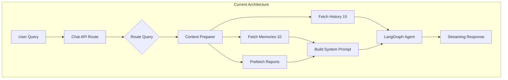
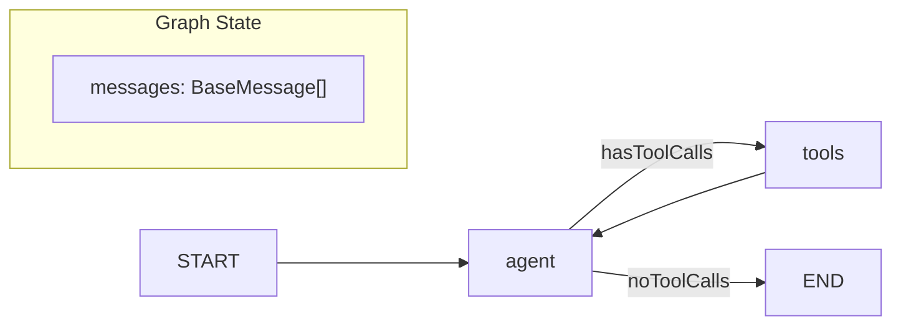
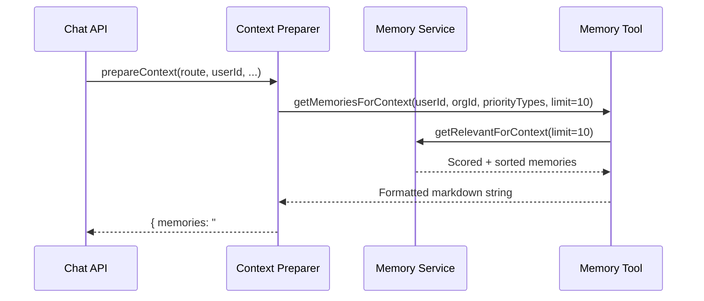
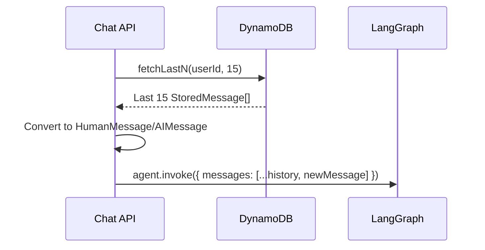
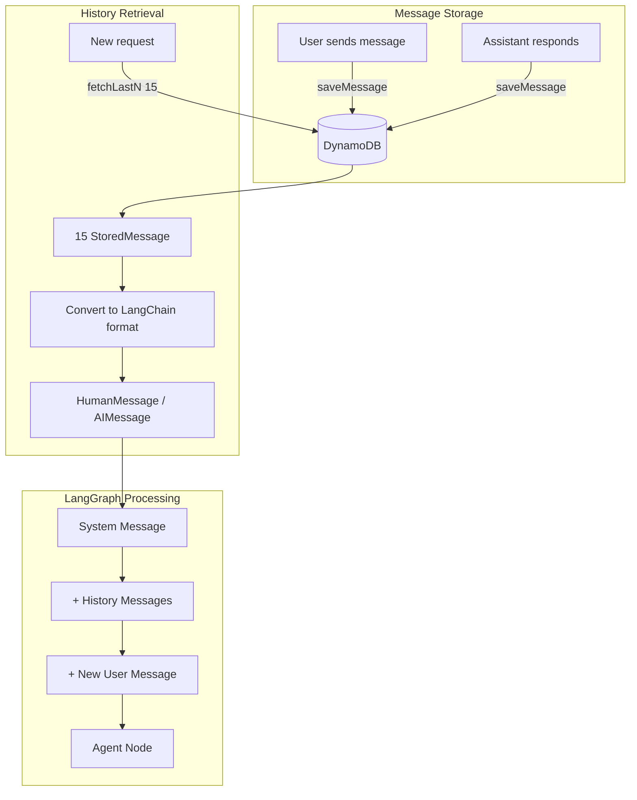
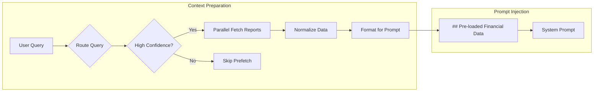
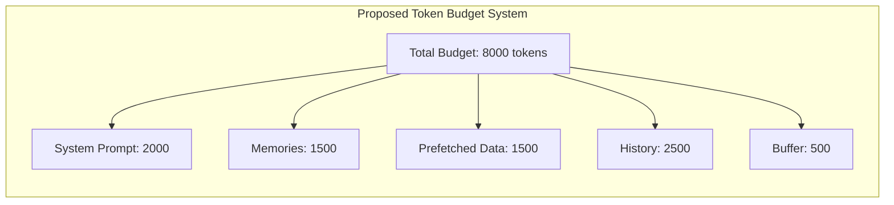
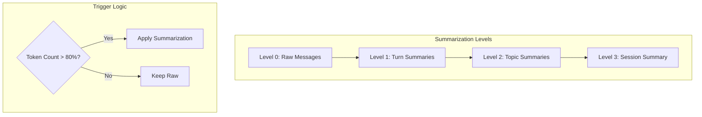

# LangGraph Context Handling Analysis

> **Comprehensive analysis of context management, memory systems, and conversation handling in Zenith-OS**
> Generated: January 2, 2026

---

## Table of Contents

1. [Executive Summary](#executive-summary)
2. [Architecture Overview](#architecture-overview)
3. [Memory System Analysis](#memory-system-analysis)
4. [Conversation History Handling](#conversation-history-handling)
5. [Data Fetching & Prefetching](#data-fetching--prefetching)
6. [Graph State Management](#graph-state-management)
7. [Current vs Best Practices Gap Analysis](#current-vs-best-practices-gap-analysis)
8. [Recommendations](#recommendations)

---

## Executive Summary

### Current Implementation Summary

| Component                | Current State                        | Limit/Configuration                    |
| ------------------------ | ------------------------------------ | -------------------------------------- |
| **Conversation History** | Last 15 messages fetched             | `fetchLastN(userId, 15)`               |
| **Memory Context**       | 10 memories injected                 | `getMemoriesForContext(..., limit=10)` |
| **Token Counting**       | Simple heuristic (4 chars = 1 token) | `estimateTokens()`                     |
| **Compression**          | None implemented                     | N/A                                    |
| **Checkpointing**        | None (stateless per-request)         | N/A                                    |
| **Store API**            | Not used                             | DynamoDB direct access                 |
| **Prefetching**          | High-confidence route prefetch       | `shouldPrefetch()`                     |

### Key Findings



---

## Architecture Overview

### Core Files Structure

```
src/ai/
├── agent.ts                    # LangGraph StateGraph (main agent)
├── index.ts                    # Agent exports
├── types.ts                    # AgentContext, ToolResponse types
├── circuit-breaker.ts          # Per-user tool isolation
├── memory/
│   ├── memoryService.ts        # DynamoDB CRUD for memories
│   └── types.ts                # Memory type definitions
├── router/
│   ├── index.ts                # Query routing exports
│   ├── contextPreparer.ts      # Prefetch + memory preparation
│   ├── matcher.ts              # Pattern matching
│   └── patterns.ts             # Intent → memory alignment
├── prompts/
│   └── system.ts               # System prompt builder
└── tools/
    ├── index.ts                # Tool aggregation (7 tools)
    ├── memory.ts               # Memory tool + getMemoriesForContext
    └── quickbooks-data/        # Financial data tools
```

### LangGraph Graph Structure



**Graph Definition** (`src/ai/agent.ts:651-660`):

```typescript
const graph = new StateGraph(MessagesAnnotation)
  .addNode('agent', agentNode)
  .addNode('tools', customToolNode)
  .addEdge(START, 'agent')
  .addConditionalEdges('agent', shouldContinue)
  .addEdge('tools', 'agent')
return graph.compile()
```

---

## Memory System Analysis

### How Memories Work

The system uses a **dedicated memory service** (`src/ai/memory/memoryService.ts`) with DynamoDB storage, NOT the LangGraph Store API.

#### Memory Types

| Type         | Description           | Use Case                 |
| ------------ | --------------------- | ------------------------ |
| `expense`    | Future cash outflows  | Payroll, bills, rent     |
| `income`     | Expected cash inflows | Contracts, receivables   |
| `goal`       | Financial targets     | Revenue goals, savings   |
| `deadline`   | Important dates       | Tax filings, renewals    |
| `context`    | Business context      | Industry, business model |
| `preference` | User preferences      | Report formats, alerts   |
| `decision`   | Recorded decisions    | Budget approvals         |

#### Memory Retrieval for Context

**Answer to your question**: The system fetches **10 memories** (not 15) for context injection.



**Code Reference** (`src/ai/tools/memory.ts:422-510`):

```typescript
export async function getMemoriesForContext(
  userId: string,
  organizationId: string,
  priorityTypes: MemoryType[] = [],
  limit = 10 // DEFAULT LIMIT IS 10
): Promise<string>
```

### Memory Scoring Algorithm

**Relevance calculation** (`src/ai/memory/memoryService.ts:285-303`):

| Factor          | Boost/Penalty | Condition             |
| --------------- | ------------- | --------------------- |
| Upcoming items  | +0.3          | Due within 7 days     |
| Near-term items | +0.2          | Due within 7-30 days  |
| Past due items  | -0.2          | Date has passed       |
| Recent creation | +0.1          | Created < 7 days ago  |
| Old memories    | -0.1          | Created > 90 days ago |

```typescript
function calculateContextRelevance(memory: Memory): number {
  let score = memory.relevanceScore || 0.5 // base score

  // Time-based adjustments
  if (daysUntilDue <= 7) score += 0.3
  else if (daysUntilDue <= 30) score += 0.2
  else if (daysUntilDue < 0) score -= 0.2

  // Recency adjustments
  if (ageInDays < 7) score += 0.1
  else if (ageInDays > 90) score -= 0.1

  return Math.max(0, Math.min(1, score)) // Clamp 0-1
}
```

### Memory Injection into Prompt

**Answer to your question**: Memories are fed as **raw formatted text**, not analyzed or compressed.

**Format** (`src/ai/tools/memory.ts:460-495`):

```markdown
## Stored Memories

**Expenses:**

- Payroll due Jan 15 ($50,000) [2026-01-15]
- Insurance renewal ($5,000) [2026-03-01]

**Income:**

- Contract payment expected ($25,000) [2026-01-20]
```

**Security**: Memories are sanitized before injection (`src/ai/agent.ts:98-112`):

```typescript
function sanitizeMemories(memories: string): string {
  // Strips injection patterns like "## SYSTEM", "You are", etc.
  return memories.replace(SUSPICIOUS_PATTERNS, '[FILTERED]')
}
```

### Token Handling for Memories

**Current State**: NO compression or token checking for memories.

The only token estimation is a simple heuristic used for logging:

```typescript
// src/lib/logger.ts:403-406
function estimateTokens(text: string): number {
  return Math.ceil(text.length / 4) // ~4 chars per token
}
```

---

## Conversation History Handling

### How History is Fetched

**Answer to your question**: The system fetches **15 raw messages** (not 7 outputs + 8 inputs pairs).



**Code Reference** (`src/app/api/chat/route.ts:418`):

```typescript
const recentMessages = await fetchLastN(userId, 15) // Fetches last 15 messages
chatHistory = recentMessages.map((m) =>
  m.role === 'user' ? new HumanMessage(m.content) : new AIMessage(m.content)
)
```

### Message Structure

```typescript
interface StoredMessage {
  id: string                    // UUID
  role: 'user' | 'assistant'    // Role type
  content: string               // Message content
  ts: number                    // Epoch milliseconds
  realmId?: string              // QuickBooks account scope
  status?: 'streaming' | 'complete'
  memories?: Array<{...}>       // Created memories
  updatedMemories?: Array<{...}>
  deletedMemories?: Array<{...}>
  components?: Array<any>       // Visualizations
  widgets?: Array<any>          // Widget data
  tokenUsage?: {...}            // Token accounting
}
```

### History Flow Diagram



### Current Limits Summary

| Limit Type         | Value        | Source                    |
| ------------------ | ------------ | ------------------------- |
| History for LLM    | 15 messages  | `route.ts:418`            |
| Pagination default | 20 messages  | `chatHistory/route.ts:36` |
| Pagination max     | 100 messages | `chatHistory/route.ts:45` |
| LocalStorage cache | 50 messages  | `useChat.ts:16`           |
| Message length     | 50,000 chars | `agent.ts:35`             |
| Rate limit         | 15 req/min   | `route.ts:24`             |
| Tool recursion     | 50 calls     | `route.ts:26`             |

---

## Data Fetching & Prefetching

### Prefetch Architecture

**Answer to your question**: Prefetched data IS added to the prompt directly - there is NO LangGraph Store.



### Prefetch Decision Logic

```typescript
// src/ai/router/contextPreparer.ts
function shouldPrefetch(route: RouteResult): boolean {
  // Only pre-fetch for high confidence with actual reports suggested
  return route.confidence === 'high' && route.reports.length > 0
}
```

### How Prefetched Data Enters the Prompt

**Flow** (`src/ai/prompts/system.ts:301-338`):

```
1. buildDynamicContext() - Company info, date, currency
2. formatPrefetchedData() - Convert reports to readable format
3. sanitizeMemories() - Clean memory text
4. buildFullPrompt() - Assemble all sections
```

**Prompt Structure**:

```markdown
[Dynamic Context: company, date, currency]
[Identity & Tools sections]
[Memory instructions]
[Guidelines]

## Pre-loaded Financial Data

The following data has been pre-loaded based on your query analysis.
Use this data directly if relevant - no need to call quickbooks_data.

### Profit & Loss

- Total Revenue: $125,000
- Total Expenses: $85,000
- Net Income: $15,000
- Period: 2024-01-01 to 2024-12-31

## User Memories

[Formatted memories section]
```

### Report Types Available for Prefetch

| Report           | Key Metrics Extracted                                    |
| ---------------- | -------------------------------------------------------- |
| Profit & Loss    | Revenue, Expenses, Gross Profit, Net Income, Period      |
| Balance Sheet    | Assets, Liabilities, Equity, As-of Date                  |
| Cash Flow        | Operating, Investing, Financing, Net Change, Cash at End |
| Aged Receivables | Total Outstanding, Customer Count                        |
| Aged Payables    | Total Outstanding, Vendor Count                          |
| Financial Health | Gross Margin, Net Margin, Current Ratio, Quick Ratio     |

---

## Graph State Management

### Current State Schema

The codebase uses LangGraph's built-in `MessagesAnnotation`:

```typescript
// src/ai/agent.ts:250-252
interface GraphState {
  messages: BaseMessage[]
}

// Uses MessagesAnnotation which provides:
// - Automatic message array management
// - add_messages reducer for appending
```

### Extended Context (Configurable)

Context flows through `config.configurable`, NOT graph state:

```typescript
interface ExtendedAgentContext extends Partial<AgentContext> {
  queryRoute?: RouteResult // Routing decision
  prefetchedData?: Record<string, unknown> // Pre-fetched reports
  preparedMemories?: string // Formatted memory text
}
```

### State Flow Diagram

```mermaid
flowchart TD
    subgraph "API Layer"
        A[Chat Request] --> B[Prepare Context]
        B --> C[Build Configurable]
    end

    subgraph "LangGraph Execution"
        C --> D[agent.invoke]
        D --> E{State: messages[]}
        E --> F[Agent Node]
        F --> G{Tool Calls?}
        G -->|Yes| H[Tool Node]
        H --> E
        G -->|No| I[END]
    end

    subgraph "Context Access"
        F --> J[config.configurable]
        J --> K[queryRoute]
        J --> L[prefetchedData]
        J --> M[preparedMemories]
    end
```

### What's NOT Using LangGraph Features

| Feature            | LangGraph Offers                 | Current Implementation    |
| ------------------ | -------------------------------- | ------------------------- |
| Checkpointer       | `MemorySaver`, `PostgresSaver`   | None - stateless          |
| Store API          | `InMemoryStore`, semantic search | DynamoDB direct           |
| State Annotations  | Custom reducers                  | Only `MessagesAnnotation` |
| Thread persistence | Built-in with `thread_id`        | Manual via DynamoDB       |

---

## Current vs Best Practices Gap Analysis

### Memory Management

| Aspect            | Current                      | Best Practice                          | Gap                 |
| ----------------- | ---------------------------- | -------------------------------------- | ------------------- |
| Memory limit      | Fixed 10                     | Token-budget based                     | No token awareness  |
| Compression       | None                         | Summarization when threshold exceeded  | Missing             |
| Relevance scoring | Time-based + recency         | Semantic + temporal + access frequency | No semantic scoring |
| Query alignment   | Intent-based type allocation | Semantic similarity search             | No embeddings       |

### Conversation History

| Aspect                 | Current           | Best Practice                                 | Gap                   |
| ---------------------- | ----------------- | --------------------------------------------- | --------------------- |
| History limit          | Fixed 15 messages | Token-based sliding window                    | No token awareness    |
| Trimming strategy      | Simple last-N     | Smart truncation preserving important context | No importance scoring |
| Summarization          | None              | Hierarchical compression                      | Missing               |
| Tool call preservation | Included in count | Separate preservation                         | Not optimized         |

### State & Persistence

| Aspect              | Current         | Best Practice                | Gap                 |
| ------------------- | --------------- | ---------------------------- | ------------------- |
| Checkpointing       | None            | MemorySaver or PostgresSaver | Missing             |
| Thread state        | Manual DynamoDB | LangGraph checkpoint API     | Not using framework |
| Cross-thread memory | Not supported   | Store API with namespaces    | Missing             |
| Branching/replay    | Not possible    | Checkpoint-based branching   | Missing             |

### Data Fetching

| Aspect            | Current          | Best Practice             | Gap          |
| ----------------- | ---------------- | ------------------------- | ------------ |
| Prefetch decision | Confidence-based | Adaptive + learning-based | Simple logic |
| Cache strategy    | None             | LRU with TTL              | Missing      |
| Embedding cache   | None             | Cached embeddings         | Missing      |

---

## Recommendations

### Priority 1: Token-Aware Context Management



**Implementation**:

```typescript
interface TokenBudget {
  total: number // e.g., 8000
  systemPrompt: number // Fixed allocation
  memories: number // Dynamic based on relevance
  prefetchedData: number // Dynamic based on query
  history: number // Sliding window
  buffer: number // Safety margin
}

async function allocateTokenBudget(query: string, route: RouteResult): Promise<TokenBudget> {
  // Allocate based on query intent and available data
}
```

### Priority 2: LangGraph Checkpointing

**Add checkpointer for conversation persistence**:

```typescript
import { MemorySaver } from '@langchain/langgraph'

const checkpointer = new MemorySaver()

const graph = new StateGraph(MessagesAnnotation)
  .addNode('agent', agentNode)
  .addNode('tools', customToolNode)
  // ... edges
  .compile({ checkpointer })

// Usage with thread_id
await graph.invoke({ messages }, { configurable: { thread_id: `user-${userId}` } })
```

### Priority 3: Intelligent History Trimming

```typescript
async function smartTrimHistory(
  messages: BaseMessage[],
  maxTokens: number,
  model: ChatModel
): Promise<BaseMessage[]> {
  // 1. Always keep system message
  // 2. Preserve tool call/result pairs
  // 3. Keep messages marked important
  // 4. Apply recency bias for remaining
  // 5. Summarize if still over budget
}
```

### Priority 4: LangGraph Store for Long-term Memory

```typescript
import { InMemoryStore } from '@langchain/langgraph'

const store = new InMemoryStore({
  index: {
    embed: embeddingsModel,
    dims: 1536,
    fields: ['content', 'metadata'],
  },
})

// Semantic memory search
const relevantMemories = await store.search(['user', userId, 'memories'], query, {
  limit: 10,
  scoreThreshold: 0.7,
})
```

### Priority 5: Hierarchical Summarization



---

## Appendix: Key File References

### Memory System

- `src/ai/memory/memoryService.ts` - Memory CRUD + relevance scoring
- `src/ai/memory/types.ts` - Memory type definitions
- `src/ai/tools/memory.ts` - Memory tool + `getMemoriesForContext()`

### Context & Prompts

- `src/ai/router/contextPreparer.ts` - Prefetch + memory preparation
- `src/ai/prompts/system.ts` - System prompt builder
- `src/ai/router/patterns.ts` - Intent → memory alignment

### LangGraph Agent

- `src/ai/agent.ts` - Main StateGraph definition
- `src/ai/circuit-breaker.ts` - Per-user tool isolation

### API Layer

- `src/app/api/chat/route.ts` - Chat endpoint orchestration
- `src/lib/chatHistory.ts` - Message storage/retrieval

---

## Summary

### Current State

- **15 messages** of history fed raw (not pairs)
- **10 memories** with time-based scoring (no semantic search)
- **No compression** or token budgeting
- **No checkpointing** - stateless per-request
- Prefetched data added directly to prompt (no Store API)
- Simple heuristic token estimation (4 chars = 1 token)

### Recommended Changes

1. Implement token-aware context management with budgets
2. Add LangGraph checkpointing for conversation persistence
3. Implement intelligent history trimming with summarization
4. Adopt LangGraph Store API for semantic memory search
5. Add hierarchical compression for long conversations
6. Implement adaptive prefetching with caching

---

_Document generated by Claude Code swarm analysis_
