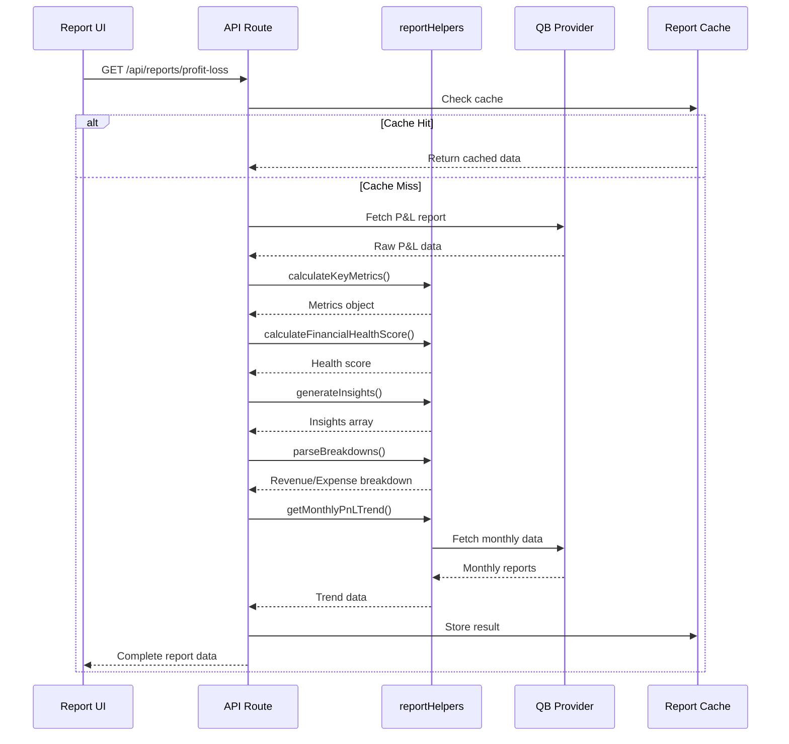
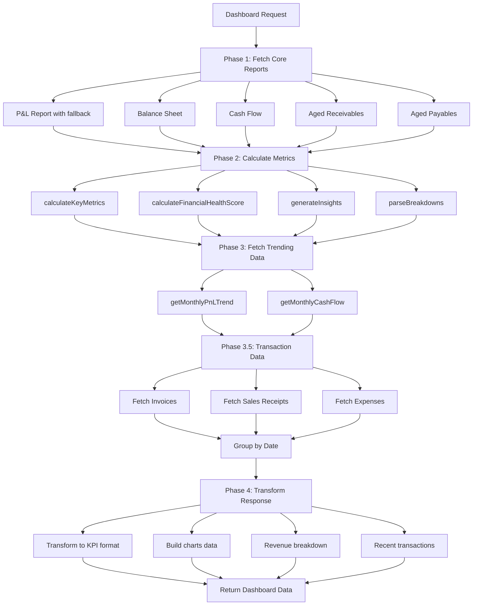
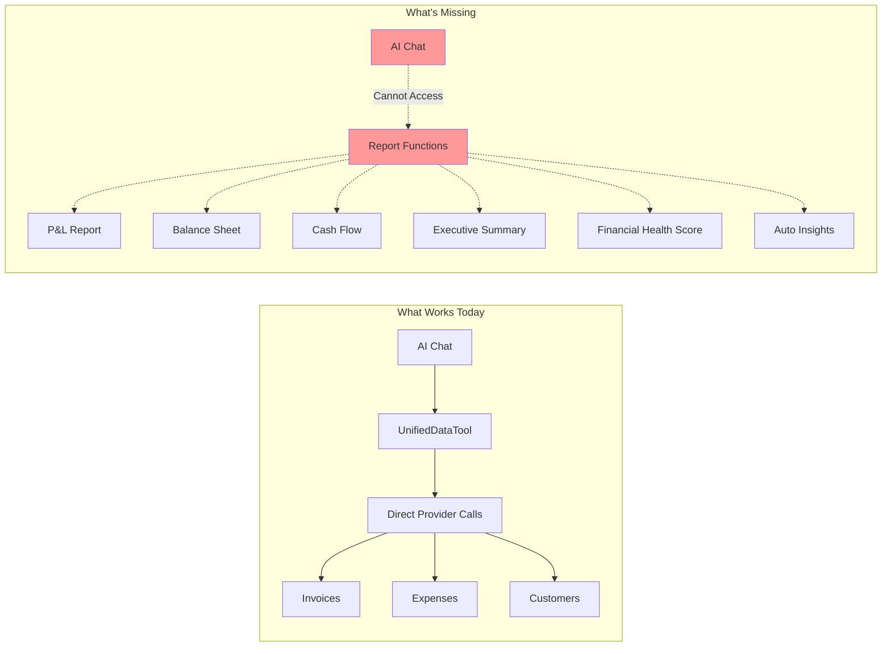
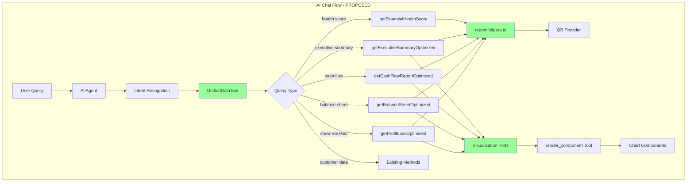
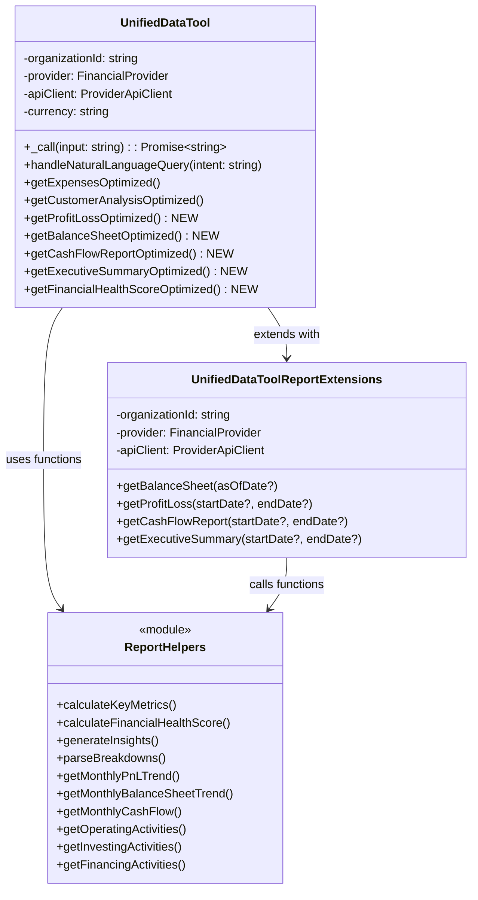

# Report Functions AI Integration Guide

## Overview

This document analyzes how the 4 report views (Profit & Loss, Balance Sheet, Cash Flow, Executive Summary) and the dashboard use reportHelper functions to fetch data, and how these functions can be integrated with the AI chat system via the unified data tool.

## Current Architecture

### System Components

```mermaid
graph TB
    subgraph "Frontend"
        UI[Report UI Pages]
        Dashboard[Dashboard Page]
        Chat[AI Chat Interface]
    end

    subgraph "API Routes"
        PnLRoute[/api/reports/profit-loss]
        BSRoute[/api/reports/balance-sheet]
        CFRoute[/api/reports/cash-flow]
        ExecRoute[/api/reports/executive-summary]
        DashRoute[/api/dashboard]
    end

    subgraph "Report Helpers"
        RH[reportHelpers.ts]
        CalcMetrics[calculateKeyMetrics]
        CalcHealth[calculateFinancialHealthScore]
        GenInsights[generateInsights]
        ParseBreak[parseBreakdowns]
        MonthlyTrends[Monthly Trend Functions]
    end

    subgraph "Provider Layer"
        Provider[QuickBooks Provider]
        API[Provider API Client]
    end

    subgraph "AI Layer"
        UnifiedTool[UnifiedDataTool]
        ReportExt[UnifiedDataToolReports<br/>SKELETON ONLY]
    end

    UI --> PnLRoute
    UI --> BSRoute
    UI --> CFRoute
    UI --> ExecRoute
    Dashboard --> DashRoute
    Chat --> UnifiedTool

    PnLRoute --> RH
    BSRoute --> RH
    CFRoute --> RH
    ExecRoute --> RH
    DashRoute --> RH

    RH --> Provider
    Provider --> API

    UnifiedTool -.->|NOT INTEGRATED| RH
    ReportExt -.->|PLANNED| RH

    style ReportExt fill:#ff9999
    style UnifiedTool fill:#ffff99
```

### Data Flow for Report Generation



## Report Helper Functions

### Core Location
**File**: `src/lib/providers/quickbooks/utils/reportHelpers.ts`

### Function Categories

#### 1. **Cross-Report Functions** (Used by all reports)

```typescript
// Calculate comprehensive financial metrics from reports
calculateKeyMetrics(pnl, balanceSheet, cashFlow, receivables, payables)
  Returns: {
    revenue: { current, grossProfit, grossMargin, netMargin },
    expenses: { current, ratio, burnRate },
    profitability: { netIncome, grossMargin, netMargin, ebitda },
    liquidity: { cashBalance, currentRatio, quickRatio, workingCapital, runwayDays },
    cashFlow: { operating, investing, financing, netChange },
    efficiency: { receivablesDays, payablesDays },
    balanceSheet: { totalAssets, totalLiabilities, totalEquity }
  }

// Calculate financial health score (0-100)
calculateFinancialHealthScore(metrics)
  Returns: {
    score: number,
    rating: 'Excellent' | 'Good' | 'Fair' | 'Needs Improvement' | 'Critical',
    components: [
      { name: 'Profitability', score, weight, metrics },
      { name: 'Liquidity', score, weight, metrics },
      { name: 'Efficiency', score, weight, metrics },
      { name: 'Cash Flow', score, weight, metrics }
    ]
  }

// Generate actionable insights
generateInsights(metrics, previousMetrics?)
  Returns: Array<{
    type: 'positive' | 'warning' | 'info',
    priority: 'high' | 'medium' | 'low',
    title: string,
    description: string,
    metric: string,
    actionable: boolean
  }>

// Parse revenue and expense breakdowns
parseBreakdowns(pnl)
  Returns: {
    revenueBreakdown: Array<{ category, amount, percentage, trend }>,
    expenseBreakdown: Array<{ category, amount, percentage, optimized }>
  }
```

#### 2. **Profit & Loss Functions**

```typescript
// Get monthly P&L trend data
getMonthlyPnLTrend(orgId, startDate, endDate, provider, apiClient)
  Returns: Array<{
    month: string,
    revenue: number,
    expenses: number,
    netIncome: number
  }>

// Generate P&L specific insights
generatePnLInsights(current, previous)
  Returns: {
    positive: string[],
    concerns: string[]
  }

// Generate detailed statement with variance
generatePnLDetailedStatement(current, previous)
  Returns: Array<{
    account: string,
    currentPeriod: number,
    previousPeriod: number,
    variance: number,
    variancePercent: number
  }>

// Validate and reconcile P&L data
validatePnLData(data)
  Returns: validated and corrected data with warnings

// Extract EBITDA components
extractEBITDAComponents(plReport)
  Returns: {
    interestExpense: number,
    taxExpense: number,
    depreciationAmortization: number
  }
```

#### 3. **Balance Sheet Functions**

```typescript
// Get asset composition breakdown
getAssetComposition(orgId, asOfDate, providerId, bsData?, QuickBooksClient?, withRetry?)
  Returns: Array<{
    name: string,
    value: number,
    displayValue: number,
    absValue: number,
    percentage: number,
    isNegative: boolean,
    color: string
  }>

// Get liability breakdown
getLiabilityBreakdown(orgId, asOfDate, providerId, bsData?, QuickBooksClient?, withRetry?)
  Returns: Array<liability objects with same structure>

// Get equity composition
getEquityComposition(orgId, asOfDate, providerId, bsData?, QuickBooksClient?, withRetry?)
  Returns: Array<equity objects with same structure>

// Get monthly balance sheet trend
getMonthlyBalanceSheetTrend(orgId, asOfDate, provider, apiClient)
  Returns: Array<{
    month: string,
    assets: number,
    liabilities: number,
    equity: number
  }>

// Get detailed accounts table
getDetailedAccountsTable(orgId, accountType, providerId, bsData?, ...)
  Returns: Array<{
    item: string,
    amount: number,
    percentage: number,
    isSubtotal?: boolean
  }>
```

#### 4. **Cash Flow Functions**

```typescript
// Get operating activities details
getOperatingActivities(orgId, startDate, endDate, netIncome, providerId, ...)
  Returns: {
    activities: Array<{ item: string, amount: number }>,
    errors: string[]
  }

// Get investing activities details
getInvestingActivities(orgId, startDate, endDate, providerId, ...)
  Returns: {
    activities: Array<{ item: string, amount: number }>,
    errors: string[]
  }

// Get financing activities details
getFinancingActivities(orgId, startDate, endDate, providerId, ...)
  Returns: {
    activities: Array<{ item: string, amount: number }>,
    errors: string[]
  }

// Get monthly cash flow trend
getMonthlyCashFlow(orgId, startDate, endDate, provider, apiClient, ...)
  Returns: Array<{
    month: string,
    operating: number,
    investing: number,
    financing: number
  }>

// Calculate cash flow metrics
calculateCashFlowMetrics(cashBalance, monthlyExpenses, operatingCashFlow, currentLiabilities, ...)
  Returns: {
    burn_rate: number,
    runway_months: number,
    days_cash: number,
    operating_cash_flow_ratio: number,
    free_cash_flow: number,
    cash_conversion_cycle: number,
    operating_cash_flow_margin?: number,
    cash_flow_coverage_ratio?: number
  }

// Calculate working capital metrics
calculateDaysReceivable(orgId, revenue, getAccountsReceivable)
calculateDaysPayable(orgId, expenses, getAccountsPayable)
calculateDaysInventory(orgId, cogs, getInventoryValue)
```

#### 5. **Utility Functions**

```typescript
// Batch processing for rate-limited queries
batchProcess<T>(items, processor, batchSize, delayMs)

// Query with pagination
queryWithPagination(client, entity, whereClause, maxResults)

// Date formatting and ranges
formatDate(date)
formatReportDate(date)
getDateRange(period)
getDefaultCashFlowStartDate()
getDefaultCashFlowEndDate()
```

## Dashboard Implementation

### Dashboard Multi-Phase Approach



### Key Dashboard Features

**File**: `src/app/api/dashboard/route.ts`

1. **Fallback Strategy for P&L**
   - Try YTD (Year-to-Date) first
   - Fall back to last complete month
   - Fall back to last 30 days
   - Track which strategy worked

2. **KPI Transformation**
   ```typescript
   transformMetricsToKPIs(metrics, currency, now)
   // Converts metrics to frontend KPI format with:
   // - metric name
   // - value
   // - trend (direction & percentage)
   // - period_end
   // - dataSource
   // - calculation description
   ```

3. **Transaction-Based Revenue Breakdown**
   - Groups invoices and sales receipts by customer
   - Calculates top revenue customers
   - Falls back to P&L breakdown if no transaction data

4. **Daily Cash Flow from Transactions**
   - Groups all transactions by date
   - Calculates daily inflow/outflow/net
   - Returns last 30 days

## The Gap: AI Integration

### Current State



### What AI Cannot Do Currently

1. **Generate Complete Reports**
   - Cannot create P&L statements with all sections
   - Cannot generate balance sheets with asset/liability/equity breakdowns
   - Cannot produce cash flow statements with operating/investing/financing activities
   - Cannot create executive summaries with health scores

2. **Calculate Advanced Metrics**
   - Cannot calculate financial health scores (0-100 rating)
   - Cannot compute EBITDA and components
   - Cannot calculate working capital metrics
   - Cannot determine runway and burn rate accurately

3. **Generate Insights**
   - Cannot auto-generate actionable insights based on financial data
   - Cannot compare current vs previous periods
   - Cannot identify trends and anomalies
   - Cannot provide rating-based assessments

4. **Provide Trending Data**
   - Cannot show monthly P&L trends
   - Cannot show balance sheet evolution over time
   - Cannot show cash flow patterns

5. **Return Visualization-Ready Data**
   - Cannot provide data structured for charts
   - Cannot include visualization hints
   - Cannot match dashboard UI experience

## Proposed Integration Architecture

### Integration Overview



### Unified Data Tool Extension



## Implementation Steps

### Step 1: Refactor Report Helpers for Standalone Use

**Goal**: Make report helper functions callable outside of API route context

**Current Issue**: Functions are designed to be called within API routes with specific context

**Changes Needed**:

```typescript
// BEFORE (tightly coupled to route)
async function getMonthlyPnLTrend(orgId, start, end, provider, apiClient) {
  // Assumes it's in a route handler context
}

// AFTER (standalone function)
export async function getMonthlyPnLTrend(
  orgId: string,
  startDate: string,
  endDate: string,
  provider: FinancialProvider,
  apiClient: ProviderApiClient
): Promise<MonthlyPnLTrend[]> {
  // Can be called from anywhere
}
```

**Files to Modify**:
- `src/lib/providers/quickbooks/utils/reportHelpers.ts`
  - Ensure all functions are exported
  - Add proper TypeScript types
  - Remove route-specific assumptions
  - Add error handling that returns errors instead of throwing

### Step 2: Create Report Data Aggregators

**Goal**: Create high-level functions that aggregate report data similar to API routes

**New Module**: `src/lib/reports/aggregators.ts`

```typescript
// Aggregates all P&L related data
export async function aggregateProfitLossData(
  organizationId: string,
  provider: FinancialProvider,
  apiClient: ProviderApiClient,
  startDate: string,
  endDate: string,
  options?: {
    includeDetails?: boolean
    includeTrends?: boolean
    includePreviousPeriod?: boolean
  }
): Promise<ProfitLossReport> {
  // 1. Fetch core P&L report
  const pnl = await provider.reports.profitAndLoss(...)

  // 2. Fetch previous period if requested
  const previousPnl = options?.includePreviousPeriod
    ? await provider.reports.profitAndLoss(...)
    : null

  // 3. Calculate metrics
  const metrics = calculateKeyMetrics(pnl, null, null, null, null)

  // 4. Get trends if requested
  const monthlyTrend = options?.includeTrends
    ? await getMonthlyPnLTrend(...)
    : []

  // 5. Parse breakdowns
  const { revenueBreakdown, expenseBreakdown } = parseBreakdowns(pnl)

  // 6. Generate insights
  const insights = generatePnLInsights(pnl, previousPnl)

  // 7. Extract EBITDA
  const ebitdaComponents = extractEBITDAComponents(pnl)

  return {
    kpis: {
      totalRevenue: pnl.total_income,
      totalExpenses: pnl.total_expenses,
      netIncome: pnl.net_income,
      profitMargin: metrics.profitability.netMargin,
      grossMargin: metrics.profitability.grossMargin,
      ...ebitdaComponents
    },
    revenueBreakdown,
    expenseBreakdown,
    monthlyTrend,
    insights
  }
}

// Similar functions for other reports
export async function aggregateBalanceSheetData(...)
export async function aggregateCashFlowData(...)
export async function aggregateExecutiveSummaryData(...)
```

### Step 3: Extend UnifiedDataTool with Report Methods

**File**: `src/lib/ai/tools/unifiedDataTool.ts`

**Add Report Methods**:

```typescript
export class UnifiedDataTool extends Tool {
  // ... existing code ...

  /**
   * Get Profit & Loss report optimized for AI
   */
  private async getProfitLossOptimized(
    startDate?: string,
    endDate?: string
  ): Promise<string> {
    try {
      const dates = this.getDefaultDateRange(startDate, endDate)

      console.log('[UnifiedDataTool] Fetching P&L report:', dates)

      // Use aggregator function
      const report = await aggregateProfitLossData(
        this.organizationId,
        this.provider,
        this.apiClient,
        dates.start,
        dates.end,
        {
          includeDetails: true,
          includeTrends: true,
          includePreviousPeriod: true
        }
      )

      // Build visualization hints
      const visualization_hints = this.buildPnLVisualizationHints(report)

      return JSON.stringify({
        success: true,
        report_type: 'profit_loss',
        period: `${dates.start} to ${dates.end}`,
        data: report,
        summary: this.buildPnLSummary(report),
        visualization_hints
      })
    } catch (error) {
      return JSON.stringify({
        error: error instanceof Error ? error.message : 'Failed to fetch P&L',
        suggestion: 'Check date range and try again'
      })
    }
  }

  /**
   * Get Balance Sheet optimized for AI
   */
  private async getBalanceSheetOptimized(
    asOfDate?: string
  ): Promise<string> {
    // Similar implementation
  }

  /**
   * Get Cash Flow report optimized for AI
   */
  private async getCashFlowReportOptimized(
    startDate?: string,
    endDate?: string
  ): Promise<string> {
    // Similar implementation
  }

  /**
   * Get Executive Summary optimized for AI
   */
  private async getExecutiveSummaryOptimized(
    startDate?: string,
    endDate?: string
  ): Promise<string> {
    // Similar implementation
  }

  /**
   * Get Financial Health Score
   */
  private async getFinancialHealthScoreOptimized(): Promise<string> {
    try {
      // Fetch minimal required data
      const [pnl, balanceSheet, cashFlow] = await Promise.all([
        this.provider.reports.profitAndLoss(...),
        this.provider.reports.balanceSheet(...),
        this.provider.reports.cashFlow(...)
      ])

      // Calculate metrics
      const metrics = calculateKeyMetrics(
        pnl,
        balanceSheet,
        cashFlow,
        null,
        null
      )

      // Calculate health score
      const healthScore = calculateFinancialHealthScore(metrics)

      // Build visualization
      const visualization_hints = [{
        type: 'gauge',
        title: 'Financial Health Score',
        data: {
          value: healthScore.score,
          max: 100,
          rating: healthScore.rating,
          components: healthScore.components
        },
        ready_to_render: true
      }]

      return JSON.stringify({
        success: true,
        score: healthScore.score,
        rating: healthScore.rating,
        components: healthScore.components,
        summary: `Financial health score: ${healthScore.score}/100 (${healthScore.rating})`,
        visualization_hints
      })
    } catch (error) {
      return JSON.stringify({
        error: error instanceof Error ? error.message : 'Failed to calculate health score'
      })
    }
  }

  /**
   * Build visualization hints for P&L report
   */
  private buildPnLVisualizationHints(report: ProfitLossReport) {
    return [
      {
        type: 'kpi_grid',
        title: 'Profit & Loss Overview',
        data: {
          kpis: [
            {
              label: 'Total Revenue',
              value: report.kpis.totalRevenue,
              format: 'currency',
              icon: 'TrendingUp',
              color: 'emerald',
              trend: report.kpis.revenueGrowth
            },
            {
              label: 'Total Expenses',
              value: report.kpis.totalExpenses,
              format: 'currency',
              icon: 'TrendingDown',
              color: 'red'
            },
            {
              label: 'Net Income',
              value: report.kpis.netIncome,
              format: 'currency',
              icon: 'DollarSign',
              color: report.kpis.netIncome >= 0 ? 'emerald' : 'red'
            },
            {
              label: 'Profit Margin',
              value: report.kpis.profitMargin,
              format: 'percentage',
              icon: 'Percent',
              color: 'blue'
            }
          ]
        },
        ready_to_render: true
      },
      {
        type: 'chart',
        title: 'Revenue Breakdown',
        chart_type: 'horizontal-bar',
        data: report.revenueBreakdown,
        ready_to_render: true
      },
      {
        type: 'chart',
        title: 'Expense Categories',
        chart_type: 'horizontal-bar',
        data: report.expenseBreakdown,
        ready_to_render: true
      },
      {
        type: 'chart',
        title: 'Monthly Trend',
        chart_type: 'area',
        data: report.monthlyTrend,
        dataKeys: [
          { key: 'revenue', color: '#10b981', name: 'Revenue' },
          { key: 'expenses', color: '#ef4444', name: 'Expenses' },
          { key: 'netIncome', color: '#f59e0b', name: 'Net Income' }
        ],
        xKey: 'month',
        ready_to_render: true
      }
    ]
  }
}
```

### Step 4: Update Intent Matching

**Add Report-Specific Intent Patterns**:

```typescript
private async handleNaturalLanguageQuery(intent: string): Promise<string> {
  const intentLower = intent.toLowerCase();

  const queryMappings = [
    // Report generation intents
    {
      keywords: ['profit and loss', 'p&l', 'pnl', 'income statement', 'profit loss report'],
      handler: () => this.getProfitLossOptimized()
    },
    {
      keywords: ['balance sheet', 'assets and liabilities', 'financial position'],
      handler: () => this.getBalanceSheetOptimized()
    },
    {
      keywords: ['cash flow statement', 'cash flow report', 'operating cash flow'],
      handler: () => this.getCashFlowReportOptimized()
    },
    {
      keywords: ['executive summary', 'financial summary', 'overall financial'],
      handler: () => this.getExecutiveSummaryOptimized()
    },
    {
      keywords: ['financial health', 'health score', 'financial rating'],
      handler: () => this.getFinancialHealthScoreOptimized()
    },

    // Existing intents...
    { keywords: ['expense_analysis'], handler: () => this.getExpensesOptimized() },
    // ... rest of mappings
  ];

  // ... rest of matching logic
}
```

### Step 5: Add Report Types to TypeScript

**File**: `src/types/reports.ts`

```typescript
export interface ProfitLossReport {
  kpis: {
    totalRevenue: number
    totalExpenses: number
    netIncome: number
    profitMargin: number
    grossMargin: number
    grossProfit: number
    operatingExpenses: number
    operatingMargin?: number
    ebitda?: number
    interestExpense?: number
    taxExpense?: number
    depreciationAmortization?: number
    revenueGrowth?: number
    expenseGrowth?: number
  }
  revenueBreakdown: Array<{
    category: string
    amount: number
    percentage: number
    trend?: string
  }>
  expenseBreakdown: Array<{
    category: string
    amount: number
    percentage: number
    optimized?: boolean
  }>
  monthlyTrend: Array<{
    month: string
    revenue: number
    expenses: number
    netIncome: number
  }>
  insights: {
    positive: string[]
    concerns: string[]
  }
  detailedStatement?: Array<{
    account: string
    currentPeriod: number
    previousPeriod?: number
    variance?: number
    variancePercent?: number
  }>
}

export interface BalanceSheetReport {
  kpis: {
    totalAssets: number
    totalLiabilities: number
    totalEquity: number
    workingCapital: number
    currentRatio: number
    quickRatio: number
    debtToEquity: number
    roa: number
    assetsGrowth?: number
    liabilitiesGrowth?: number
    equityGrowth?: number
  }
  assetComposition: Array<{
    name: string
    value: number
    percentage: number
    color?: string
  }>
  liabilityBreakdown: Array<{
    name: string
    value: number
    percentage: number
    color?: string
  }>
  equityComposition: Array<{
    name: string
    value: number
    percentage: number
    color?: string
  }>
  monthlyTrend: Array<{
    month: string
    assets: number
    liabilities: number
    equity: number
  }>
  ratios: {
    assetTurnover: number
    equityMultiplier: number
    returnOnEquity: number
    debtRatio: number
  }
}

export interface CashFlowReport {
  kpis: {
    operatingCashFlow: number
    investingCashFlow: number
    financingCashFlow: number
    netCashFlow: number
    beginningCash: number
    endingCash: number
    freeCashFlow?: number
    runway?: number
    daysCashOnHand?: number
    operatingCashFlowRatio?: number
  }
  operatingActivities?: Array<{
    item: string
    amount: number
  }>
  investingActivities?: Array<{
    item: string
    amount: number
  }>
  financingActivities?: Array<{
    item: string
    amount: number
  }>
  monthlyTrend: Array<{
    month: string
    operating: number
    investing: number
    financing: number
  }>
  waterfall: Array<{
    name: string
    value: number
  }>
  errors?: string[]
}

export interface ExecutiveSummaryReport {
  healthScore: {
    overall: number
    rating: string
    components: Array<{
      name: string
      score: number
      weight: number
      metrics: any
    }>
  }
  metrics: {
    revenue: {
      current: number
      previous?: number
      change?: number
      changePercent?: number
      grossMargin: number
      netMargin: number
    }
    profit: {
      current: number
      previous?: number
      change?: number
      changePercent?: number
      margin: number
      ebitda: number
    }
    expenses: {
      current: number
      previous?: number
      change?: number
      changePercent?: number
      ratio: number
      burnRate: number
    }
    cashFlow: {
      current: number
      operating: number
      investing: number
      financing: number
      runway: number
      burnRate: number
    }
  }
  insights: Array<{
    type: string
    priority: string
    title: string
    description: string
    metric: string
    actionable: boolean
  }>
  revenueBreakdown: any[]
  expenseBreakdown: any[]
  workingCapital: {
    accountsReceivable: { total: number; dso: number }
    accountsPayable: { total: number; dpo: number }
    netWorkingCapital: number
  }
  balanceSheet: {
    totalAssets: number
    totalLiabilities: number
    totalEquity: number
    currentRatio: number
    quickRatio: number
  }
}
```

### Step 6: Create Visualization Hint Builders

**File**: `src/lib/ai/utils/visualizationBuilders.ts`

```typescript
import {
  ProfitLossReport,
  BalanceSheetReport,
  CashFlowReport,
  ExecutiveSummaryReport
} from '@/types/reports'

export function buildPnLVisualizationHints(report: ProfitLossReport) {
  return [
    // KPI Cards
    {
      type: 'kpi_grid',
      title: 'Profit & Loss Overview',
      data: { kpis: [...] },
      ready_to_render: true
    },
    // Revenue chart
    {
      type: 'chart',
      title: 'Revenue Breakdown',
      chart_type: 'horizontal-bar',
      data: report.revenueBreakdown,
      ready_to_render: true
    },
    // Expense chart
    {
      type: 'chart',
      title: 'Expense Categories',
      chart_type: 'horizontal-bar',
      data: report.expenseBreakdown,
      ready_to_render: true
    },
    // Trend chart
    {
      type: 'chart',
      title: 'Monthly P&L Trend',
      chart_type: 'area',
      data: report.monthlyTrend,
      dataKeys: [
        { key: 'revenue', color: '#10b981', name: 'Revenue' },
        { key: 'expenses', color: '#ef4444', name: 'Expenses' },
        { key: 'netIncome', color: '#f59e0b', name: 'Net Income' }
      ],
      xKey: 'month',
      ready_to_render: true
    },
    // Insights
    {
      type: 'insights',
      title: 'Key Insights',
      data: report.insights,
      ready_to_render: true
    }
  ]
}

export function buildBalanceSheetVisualizationHints(report: BalanceSheetReport) {
  // Similar structure for balance sheet
}

export function buildCashFlowVisualizationHints(report: CashFlowReport) {
  // Similar structure for cash flow
}

export function buildExecutiveSummaryVisualizationHints(report: ExecutiveSummaryReport) {
  // Similar structure for executive summary
}
```

### Step 7: Testing Strategy

#### Unit Tests

```typescript
// src/lib/ai/tools/__tests__/unifiedDataTool.reports.test.ts

describe('UnifiedDataTool Report Integration', () => {
  let tool: UnifiedDataTool
  let mockProvider: jest.Mocked<FinancialProvider>

  beforeEach(() => {
    mockProvider = createMockProvider()
    tool = new UnifiedDataTool(
      'test-org-id',
      mockProvider,
      mockApiClient,
      'USD'
    )
  })

  describe('getProfitLossOptimized', () => {
    it('should fetch and format P&L report', async () => {
      mockProvider.reports.profitAndLoss.mockResolvedValue(mockPnLData)

      const result = await tool['getProfitLossOptimized']()
      const parsed = JSON.parse(result)

      expect(parsed.success).toBe(true)
      expect(parsed.report_type).toBe('profit_loss')
      expect(parsed.data.kpis).toBeDefined()
      expect(parsed.visualization_hints).toHaveLength(5)
    })

    it('should include monthly trends', async () => {
      const result = await tool['getProfitLossOptimized']()
      const parsed = JSON.parse(result)

      expect(parsed.data.monthlyTrend).toBeDefined()
      expect(Array.isArray(parsed.data.monthlyTrend)).toBe(true)
    })

    it('should handle errors gracefully', async () => {
      mockProvider.reports.profitAndLoss.mockRejectedValue(
        new Error('API Error')
      )

      const result = await tool['getProfitLossOptimized']()
      const parsed = JSON.parse(result)

      expect(parsed.error).toBeDefined()
      expect(parsed.suggestion).toBeDefined()
    })
  })

  describe('getFinancialHealthScoreOptimized', () => {
    it('should calculate health score', async () => {
      mockProvider.reports.profitAndLoss.mockResolvedValue(mockPnLData)
      mockProvider.reports.balanceSheet.mockResolvedValue(mockBSData)
      mockProvider.reports.cashFlow.mockResolvedValue(mockCFData)

      const result = await tool['getFinancialHealthScoreOptimized']()
      const parsed = JSON.parse(result)

      expect(parsed.success).toBe(true)
      expect(parsed.score).toBeGreaterThanOrEqual(0)
      expect(parsed.score).toBeLessThanOrEqual(100)
      expect(parsed.rating).toBeDefined()
      expect(parsed.components).toHaveLength(4)
    })
  })

  describe('Intent Matching', () => {
    it('should route P&L intents correctly', async () => {
      const intents = [
        'show me profit and loss',
        'generate p&l report',
        'what is our pnl'
      ]

      for (const intent of intents) {
        const spy = jest.spyOn(tool as any, 'getProfitLossOptimized')
        await tool['handleNaturalLanguageQuery'](intent)
        expect(spy).toHaveBeenCalled()
      }
    })

    it('should route balance sheet intents correctly', async () => {
      const intent = 'show me balance sheet'
      const spy = jest.spyOn(tool as any, 'getBalanceSheetOptimized')
      await tool['handleNaturalLanguageQuery'](intent)
      expect(spy).toHaveBeenCalled()
    })

    it('should route health score intents correctly', async () => {
      const intent = 'what is our financial health score'
      const spy = jest.spyOn(tool as any, 'getFinancialHealthScoreOptimized')
      await tool['handleNaturalLanguageQuery'](intent)
      expect(spy).toHaveBeenCalled()
    })
  })
})
```

#### Integration Tests

```typescript
// src/lib/ai/tools/__tests__/unifiedDataTool.integration.test.ts

describe('UnifiedDataTool Report Integration - E2E', () => {
  it('should generate complete P&L report from real API', async () => {
    const tool = createRealUnifiedDataTool()

    const result = await tool._call(JSON.stringify({
      intent: 'show me profit and loss for last quarter'
    }))

    const parsed = JSON.parse(result)

    expect(parsed.success).toBe(true)
    expect(parsed.data.kpis.totalRevenue).toBeGreaterThan(0)
    expect(parsed.visualization_hints.length).toBeGreaterThan(0)
  })

  it('should handle chat conversation flow', async () => {
    // User: "Show me our financial health"
    const health = await tool._call(JSON.stringify({
      intent: 'financial health score'
    }))

    expect(JSON.parse(health).score).toBeDefined()

    // User: "Now show me the P&L"
    const pnl = await tool._call(JSON.stringify({
      intent: 'profit and loss'
    }))

    expect(JSON.parse(pnl).data.kpis).toBeDefined()

    // User: "What about cash flow?"
    const cashflow = await tool._call(JSON.stringify({
      intent: 'cash flow report'
    }))

    expect(JSON.parse(cashflow).data.kpis.operatingCashFlow).toBeDefined()
  })
})
```

## Expected Outcomes

### Before Integration

```
User: "Show me a profit and loss report"
AI: "I can show you recent invoices and expenses, but I cannot
     generate a complete P&L report. You can view the P&L report
     by going to the Reports page."
```

### After Integration

```
User: "Show me a profit and loss report"
AI: [Calls unified_data with intent: "profit and loss"]
    [Receives complete P&L data with visualization hints]

AI: "Here's your Profit & Loss report for January 2025:

    📊 [KPI Cards rendered showing:]
    • Total Revenue: $125,430 (+15.2% vs last month)
    • Total Expenses: $89,200 (-3.1%)
    • Net Income: $36,230 (+28.5%)
    • Profit Margin: 28.9%

    📈 [Revenue Breakdown Chart]
    • Service Revenue: $95,000 (75.7%)
    • Product Sales: $25,000 (19.9%)
    • Other Income: $5,430 (4.3%)

    📉 [Expense Categories Chart]
    • Operating Expenses: $55,000 (61.7%)
    • Cost of Goods Sold: $25,000 (28.0%)
    • Other Expenses: $9,200 (10.3%)

    📊 [Monthly Trend Chart showing last 6 months]

    💡 Key Insights:
    • ✅ Revenue increased 15.2% compared to last month
    • ✅ Profit margin improved by 3.4 percentage points
    • ⚠️ Operating expenses as % of revenue at 43.8%

    Your business is showing strong profitability with healthy growth!"
```

### User Conversation Examples

#### Example 1: Financial Health Check

```
User: "How is my business doing financially?"

AI: [Calls getFinancialHealthScoreOptimized()]

AI: "Your business has a financial health score of 78/100 - rated as 'Good'!

    📊 [Gauge Chart showing 78/100]

    Here's the breakdown:

    ✅ Profitability: 85/100 (Weight: 30%)
    • Strong gross margin of 42%
    • Net margin of 28.9%

    ✅ Liquidity: 72/100 (Weight: 25%)
    • Current ratio: 1.8
    • Quick ratio: 1.4
    • Working capital: $45,000

    ⚠️ Efficiency: 68/100 (Weight: 25%)
    • Receivables days: 38 days
    • Payables days: 32 days

    ✅ Cash Flow: 82/100 (Weight: 20%)
    • Positive operating cash flow
    • Runway: 8 months

    Your profitability and cash flow are strong. Consider improving
    collection times to boost your efficiency score!"
```

#### Example 2: Detailed Financial Analysis

```
User: "Give me a comprehensive financial analysis"

AI: [Calls getExecutiveSummaryOptimized()]

AI: "Here's your comprehensive financial summary:

    📊 Overall Health Score: 78/100 (Good)

    💰 Revenue Performance:
    • Current Period: $125,430
    • vs Previous: +15.2% ($109,200)
    • Gross Margin: 42.0%
    • Net Margin: 28.9%

    [Revenue breakdown chart]

    💸 Expense Management:
    • Total Expenses: $89,200
    • vs Previous: -3.1% ($92,050)
    • Expense Ratio: 71.1% of revenue
    • Burn Rate: $7,400/month

    [Expense breakdown chart]

    💵 Cash Flow:
    • Operating: $32,000
    • Investing: -$5,000
    • Financing: $0
    • Net Change: +$27,000
    • Cash Runway: 8 months

    [Cash flow waterfall chart]

    📈 Working Capital:
    • Accounts Receivable: $25,000 (38 DSO)
    • Accounts Payable: $18,000 (32 DPO)
    • Net Working Capital: $45,000

    💡 Key Insights:
    • ✅ Revenue growth accelerating (+15.2%)
    • ✅ Profit margin improved significantly
    • ✅ Positive operating cash flow
    • ⚠️ Consider reducing DSO to improve cash conversion
    • ℹ️ Strong financial position overall

    Would you like me to dive deeper into any specific area?"
```

#### Example 3: Specific Report Request

```
User: "Show me the balance sheet"

AI: [Calls getBalanceSheetOptimized()]

AI: "Here's your Balance Sheet as of January 31, 2025:

    📊 [KPI Cards:]
    • Total Assets: $245,000 (+12.5% YoY)
    • Total Liabilities: $95,000
    • Total Equity: $150,000
    • Working Capital: $45,000

    🏦 Asset Composition:
    [Horizontal bar chart showing:]
    • Current Assets: $125,000 (51.0%)
      - Cash: $60,000
      - Accounts Receivable: $25,000
      - Inventory: $40,000
    • Fixed Assets: $100,000 (40.8%)
    • Other Assets: $20,000 (8.2%)

    💳 Liability Breakdown:
    [Horizontal bar chart showing:]
    • Current Liabilities: $75,000 (78.9%)
      - Accounts Payable: $18,000
      - Credit Cards: $12,000
      - Short-term Loans: $45,000
    • Long-term Liabilities: $20,000 (21.1%)

    📈 6-Month Trend:
    [Line chart showing assets, liabilities, and equity over time]

    📊 Key Ratios:
    • Current Ratio: 1.67 (Healthy)
    • Quick Ratio: 1.13 (Good)
    • Debt-to-Equity: 0.63 (Moderate)
    • ROA: 14.8%

    Your balance sheet shows solid financial health with good liquidity!"
```

## Benefits of Integration

### For Users

1. **Instant Reports**: Get complete financial reports through chat without navigating UI
2. **Conversational Analysis**: Ask questions naturally and get detailed answers
3. **Visual Insights**: See charts and KPIs inline with AI responses
4. **Contextual Recommendations**: Get AI insights based on actual financial data
5. **Time Savings**: No need to generate reports manually, AI does it instantly

### For Developers

1. **Code Reuse**: Leverage existing report functions across API routes and AI
2. **Consistency**: Same calculations and logic used everywhere
3. **Maintainability**: Single source of truth for financial calculations
4. **Extensibility**: Easy to add new report types and metrics
5. **Type Safety**: Full TypeScript support for report structures

### For the Business

1. **Better UX**: Users can get insights faster through chat
2. **Reduced Support**: AI can answer financial questions automatically
3. **Data Accuracy**: Same tested functions used in reports and chat
4. **Feature Differentiation**: Advanced AI capabilities set product apart
5. **User Engagement**: More interactive and helpful AI experience

## Migration Path

### Phase 1: Foundation (Week 1)
- [ ] Refactor reportHelpers.ts for standalone use
- [ ] Create aggregator functions
- [ ] Add TypeScript types for reports
- [ ] Write unit tests for aggregators

### Phase 2: Integration (Week 2)
- [ ] Add report methods to UnifiedDataTool
- [ ] Implement visualization hint builders
- [ ] Update intent matching
- [ ] Write integration tests

### Phase 3: Testing (Week 3)
- [ ] End-to-end testing with real data
- [ ] Performance testing and optimization
- [ ] Error handling and edge cases
- [ ] Documentation updates

### Phase 4: Rollout (Week 4)
- [ ] Feature flag for gradual rollout
- [ ] Monitor usage and errors
- [ ] Gather user feedback
- [ ] Iterate based on feedback

## Conclusion

The integration of report functions into the AI chat system will:

1. **Enable the AI** to generate complete financial reports (P&L, Balance Sheet, Cash Flow, Executive Summary)
2. **Provide sophisticated metrics** like financial health scores, EBITDA, working capital metrics
3. **Generate actionable insights** automatically based on financial data
4. **Deliver visualization-ready data** for charts and KPIs
5. **Create a unified experience** between the dashboard and AI chat

The implementation follows a clear path of refactoring, aggregation, integration, and testing to ensure a robust and maintainable solution.
